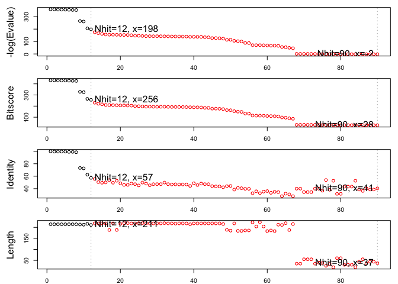
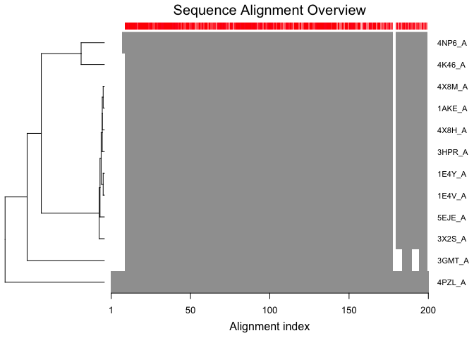
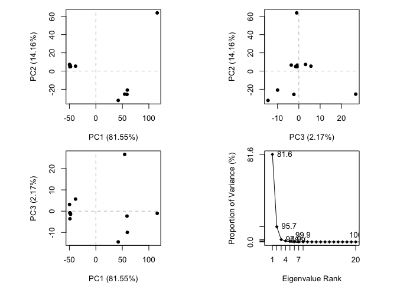

## PDB Statistics 

Import out PDB statistics CSV file and calculate precent strucutres by experimental method 

```r
p <- read.csv("Data Export Summary.csv", row.names = 1)
```


```r
percent <- (p$Total/sum(p$Total)) *100
names(percent) <-  row.names(p)
percent
```

```
##               X-Ray                 NMR Electron Microscopy 
##         89.51673340          8.71321614          1.51239392 
##               Other        Multi Method 
##          0.16986775          0.08778879
```


## Using Bio3D

Load the bio3d package


```r
library(bio3d)
```

Read in our HIV-Pr structure 


```r
pdb <- read.pdb("1hsg")
```

```
##   Note: Accessing on-line PDB file
```

```r
pdb
```

```
## 
##  Call:  read.pdb(file = "1hsg")
## 
##    Total Models#: 1
##      Total Atoms#: 1686,  XYZs#: 5058  Chains#: 2  (values: A B)
## 
##      Protein Atoms#: 1514  (residues/Calpha atoms#: 198)
##      Nucleic acid Atoms#: 0  (residues/phosphate atoms#: 0)
## 
##      Non-protein/nucleic Atoms#: 172  (residues: 128)
##      Non-protein/nucleic resid values: [ HOH (127), MK1 (1) ]
## 
##    Protein sequence:
##       PQITLWQRPLVTIKIGGQLKEALLDTGADDTVLEEMSLPGRWKPKMIGGIGGFIKVRQYD
##       QILIEICGHKAIGTVLVGPTPVNIIGRNLLTQIGCTLNFPQITLWQRPLVTIKIGGQLKE
##       ALLDTGADDTVLEEMSLPGRWKPKMIGGIGGFIKVRQYDQILIEICGHKAIGTVLVGPTP
##       VNIIGRNLLTQIGCTLNF
## 
## + attr: atom, xyz, seqres, helix, sheet,
##         calpha, remark, call
```


```r
attributes(pdb)
```

```
## $names
## [1] "atom"   "xyz"    "seqres" "helix"  "sheet"  "calpha" "remark" "call"  
## 
## $class
## [1] "pdb" "sse"
```


```r
head(pdb$atom)
```

```
##   type eleno elety  alt resid chain resno insert      x      y     z o
## 1 ATOM     1     N <NA>   PRO     A     1   <NA> 29.361 39.686 5.862 1
## 2 ATOM     2    CA <NA>   PRO     A     1   <NA> 30.307 38.663 5.319 1
## 3 ATOM     3     C <NA>   PRO     A     1   <NA> 29.760 38.071 4.022 1
## 4 ATOM     4     O <NA>   PRO     A     1   <NA> 28.600 38.302 3.676 1
## 5 ATOM     5    CB <NA>   PRO     A     1   <NA> 30.508 37.541 6.342 1
## 6 ATOM     6    CG <NA>   PRO     A     1   <NA> 29.296 37.591 7.162 1
##       b segid elesy charge
## 1 38.10  <NA>     N   <NA>
## 2 40.62  <NA>     C   <NA>
## 3 42.64  <NA>     C   <NA>
## 4 43.40  <NA>     O   <NA>
## 5 37.87  <NA>     C   <NA>
## 6 38.40  <NA>     C   <NA>
```

# Print a subset of $atom data for the first two atoms

```r
pdb$atom[1:2, c("eleno", "elety", "x","y","z")]
```

```
##   eleno elety      x      y     z
## 1     1     N 29.361 39.686 5.862
## 2     2    CA 30.307 38.663 5.319
```

# Note that individual $atom records can also be accessed like this

```r
pdb$atom$elety[1:2]
```

```
## [1] "N"  "CA"
```

# Which allows us to do the following

```r
#plot.bio3d(pdb$atom$b[pdb$calpha], sse=pdb, typ="l", ylab=“B-factor”)
```

# Print a summary of the coordinate data in $xyz

```r
pdb$xyz
```

```
## 
##    Total Frames#: 1
##    Total XYZs#:   5058,  (Atoms#:  1686)
## 
##     [1]  29.361  39.686  5.862  <...>  30.112  17.912  -4.791  [5058] 
## 
## + attr: Matrix DIM = 1 x 5058
```

# Examine the row and column dimensions

```r
dim(pdb$xyz)
```

```
## [1]    1 5058
```

# Print coordinates for the first two atom

```r
pdb$xyz[ 1, atom2xyz(1:2) ]
```

```
## [1] 29.361 39.686  5.862 30.307 38.663  5.319
```

# Select all C-alpha atoms (return their indices)

```r
ca.inds <- atom.select(pdb, "calpha")
ca.inds
```

```
## 
##  Call:  atom.select.pdb(pdb = pdb, string = "calpha")
## 
##    Atom Indices#: 198  ($atom)
##    XYZ  Indices#: 594  ($xyz)
## 
## + attr: atom, xyz, call
```


# Print details of the first few selected atoms

```r
head( pdb$atom[ca.inds$atom, ] )
```

```
##    type eleno elety  alt resid chain resno insert      x      y     z o
## 2  ATOM     2    CA <NA>   PRO     A     1   <NA> 30.307 38.663 5.319 1
## 9  ATOM     9    CA <NA>   GLN     A     2   <NA> 30.158 36.492 2.199 1
## 18 ATOM    18    CA <NA>   ILE     A     3   <NA> 29.123 33.098 3.397 1
## 26 ATOM    26    CA <NA>   THR     A     4   <NA> 29.774 30.143 1.062 1
## 33 ATOM    33    CA <NA>   LEU     A     5   <NA> 27.644 27.003 1.144 1
## 41 ATOM    41    CA <NA>   TRP     A     6   <NA> 30.177 24.150 1.279 1
##        b segid elesy charge
## 2  40.62  <NA>     C   <NA>
## 9  41.30  <NA>     C   <NA>
## 18 34.13  <NA>     C   <NA>
## 26 30.14  <NA>     C   <NA>
## 33 30.12  <NA>     C   <NA>
## 41 30.82  <NA>     C   <NA>
```


# And selected xyz coordinates

```r
head( pdb$xyz[, ca.inds$xyz] )
```

```
## [1] 30.307 38.663  5.319 30.158 36.492  2.199
```


# Select chain A

```r
a.inds <- atom.select(pdb, chain="A")
```

# Select C-alphas of chain A

```r
ca.inds <- atom.select(pdb, "calpha", chain="A")
```

# We can combine multiple selection criteria to return their intersection

```r
cab.inds <- atom.select(pdb, elety=c("CA","CB"), chain="A", resno=10:20)
```


#Q8. Use the Bio3D write.pdb() function to write out a protein only PDB file for viewing in VMD. Also write out a second separate PDB file for the ligand with residue name MK1


```r
inds.ligand <- atom.select(pdb, "ligand")
inds.protein <- atom.select(pdb, "protein")
inds.protein
```

```
## 
##  Call:  atom.select.pdb(pdb = pdb, string = "protein")
## 
##    Atom Indices#: 1514  ($atom)
##    XYZ  Indices#: 4542  ($xyz)
## 
## + attr: atom, xyz, call
```


Check we have what we want

```r
pdb$atom[inds.ligand$atom,]
```

```
##        type eleno elety  alt resid chain resno insert      x      y      z
## 1515 HETATM  1517    N1 <NA>   MK1     B   902   <NA>  9.280 23.763  3.004
## 1516 HETATM  1518    C1 <NA>   MK1     B   902   <NA>  9.498 23.983  4.459
## 1517 HETATM  1519    C2 <NA>   MK1     B   902   <NA> 10.591 24.905  4.962
## 1518 HETATM  1520    C3 <NA>   MK1     B   902   <NA> 10.591 24.864  6.466
## 1519 HETATM  1521    O1 <NA>   MK1     B   902   <NA> 10.937 23.849  7.057
## 1520 HETATM  1522    N2 <NA>   MK1     B   902   <NA> 10.193 25.953  7.094
## 1521 HETATM  1523    C4 <NA>   MK1     B   902   <NA> 10.145 26.250  8.490
## 1522 HETATM  1524    C5 <NA>   MK1     B   902   <NA>  9.379 27.577  8.641
## 1523 HETATM  1525    C6 <NA>   MK1     B   902   <NA> 11.398 26.347  9.074
## 1524 HETATM  1526    C7 <NA>   MK1     B   902   <NA>  9.364 25.283  9.268
## 1525 HETATM  1527    N3 <NA>   MK1     B   902   <NA> 11.819 24.282  4.355
## 1526 HETATM  1528    C8 <NA>   MK1     B   902   <NA> 11.753 23.776  2.961
## 1527 HETATM  1529    C9 <NA>   MK1     B   902   <NA> 10.440 23.182  2.493
## 1528 HETATM  1530   C10 <NA>   MK1     B   902   <NA> 13.083 24.963  4.552
## 1529 HETATM  1531   C11 <NA>   MK1     B   902   <NA> 14.203 24.064  5.078
## 1530 HETATM  1532    O2 <NA>   MK1     B   902   <NA> 15.242 24.884  4.634
## 1531 HETATM  1533   C12 <NA>   MK1     B   902   <NA> 14.440 23.761  6.569
## 1532 HETATM  1534   C13 <NA>   MK1     B   902   <NA> 15.573 22.821  7.005
## 1533 HETATM  1535   C14 <NA>   MK1     B   902   <NA> 15.644 22.664  8.534
## 1534 HETATM  1536   C15 <NA>   MK1     B   902   <NA> 16.733 21.750  8.961
## 1535 HETATM  1537   C16 <NA>   MK1     B   902   <NA> 18.058 21.916  8.553
## 1536 HETATM  1538   C17 <NA>   MK1     B   902   <NA> 19.037 21.016  8.947
## 1537 HETATM  1539   C18 <NA>   MK1     B   902   <NA> 18.673 19.939  9.758
## 1538 HETATM  1540   C19 <NA>   MK1     B   902   <NA> 17.347 19.773 10.176
## 1539 HETATM  1541   C20 <NA>   MK1     B   902   <NA> 16.374 20.687  9.772
## 1540 HETATM  1542   C21 <NA>   MK1     B   902   <NA> 15.447 21.440  6.373
## 1541 HETATM  1543    O3 <NA>   MK1     B   902   <NA> 14.367 20.831  6.397
## 1542 HETATM  1544    N4 <NA>   MK1     B   902   <NA> 16.583 20.913  5.924
## 1543 HETATM  1545   C22 <NA>   MK1     B   902   <NA> 16.692 19.500  5.604
## 1544 HETATM  1546   C23 <NA>   MK1     B   902   <NA> 18.067 18.945  5.936
## 1545 HETATM  1547    O4 <NA>   MK1     B   902   <NA> 19.061 19.938  5.729
## 1546 HETATM  1548   C24 <NA>   MK1     B   902   <NA> 18.226 17.726  5.057
## 1547 HETATM  1549   C25 <NA>   MK1     B   902   <NA> 17.476 17.904  3.760
## 1548 HETATM  1550   C26 <NA>   MK1     B   902   <NA> 17.500 17.363  2.496
## 1549 HETATM  1551   C27 <NA>   MK1     B   902   <NA> 16.613 17.872  1.541
## 1550 HETATM  1552   C28 <NA>   MK1     B   902   <NA> 15.722 18.906  1.865
## 1551 HETATM  1553   C29 <NA>   MK1     B   902   <NA> 15.683 19.479  3.129
## 1552 HETATM  1554   C30 <NA>   MK1     B   902   <NA> 16.504 19.061  4.128
## 1553 HETATM  1555   C31 <NA>   MK1     B   902   <NA>  8.033 23.100  2.604
## 1554 HETATM  1556   C32 <NA>   MK1     B   902   <NA>  6.666 23.739  2.876
## 1555 HETATM  1557   C33 <NA>   MK1     B   902   <NA>  6.158 24.808  2.124
## 1556 HETATM  1558    N5 <NA>   MK1     B   902   <NA>  4.911 25.430  2.300
## 1557 HETATM  1559   C34 <NA>   MK1     B   902   <NA>  4.207 24.839  3.348
## 1558 HETATM  1560   C35 <NA>   MK1     B   902   <NA>  4.654 23.774  4.136
## 1559 HETATM  1561   C36 <NA>   MK1     B   902   <NA>  5.905 23.211  3.897
##      o     b segid elesy charge
## 1515 1 28.25  <NA>     N   <NA>
## 1516 1 30.30  <NA>     C   <NA>
## 1517 1 27.27  <NA>     C   <NA>
## 1518 1 28.85  <NA>     C   <NA>
## 1519 1 29.59  <NA>     O   <NA>
## 1520 1 22.29  <NA>     N   <NA>
## 1521 1 23.47  <NA>     C   <NA>
## 1522 1 27.66  <NA>     C   <NA>
## 1523 1 21.71  <NA>     C   <NA>
## 1524 1 22.75  <NA>     C   <NA>
## 1525 1 28.91  <NA>     N   <NA>
## 1526 1 26.24  <NA>     C   <NA>
## 1527 1 27.47  <NA>     C   <NA>
## 1528 1 20.86  <NA>     C   <NA>
## 1529 1 21.68  <NA>     C   <NA>
## 1530 1 15.87  <NA>     O   <NA>
## 1531 1 21.49  <NA>     C   <NA>
## 1532 1 26.89  <NA>     C   <NA>
## 1533 1 28.67  <NA>     C   <NA>
## 1534 1 26.89  <NA>     C   <NA>
## 1535 1 29.22  <NA>     C   <NA>
## 1536 1 29.22  <NA>     C   <NA>
## 1537 1 30.97  <NA>     C   <NA>
## 1538 1 29.25  <NA>     C   <NA>
## 1539 1 29.96  <NA>     C   <NA>
## 1540 1 29.35  <NA>     C   <NA>
## 1541 1 32.66  <NA>     O   <NA>
## 1542 1 31.19  <NA>     N   <NA>
## 1543 1 29.22  <NA>     C   <NA>
## 1544 1 28.82  <NA>     C   <NA>
## 1545 1 28.32  <NA>     O   <NA>
## 1546 1 32.05  <NA>     C   <NA>
## 1547 1 31.29  <NA>     C   <NA>
## 1548 1 32.00  <NA>     C   <NA>
## 1549 1 28.00  <NA>     C   <NA>
## 1550 1 29.01  <NA>     C   <NA>
## 1551 1 27.70  <NA>     C   <NA>
## 1552 1 31.86  <NA>     C   <NA>
## 1553 1 36.25  <NA>     C   <NA>
## 1554 1 42.75  <NA>     C   <NA>
## 1555 1 47.41  <NA>     C   <NA>
## 1556 1 51.38  <NA>     N   <NA>
## 1557 1 50.60  <NA>     C   <NA>
## 1558 1 49.34  <NA>     C   <NA>
## 1559 1 44.71  <NA>     C   <NA>
```


```r
head(pdb$atom[inds.protein$atom,])
```

```
##   type eleno elety  alt resid chain resno insert      x      y     z o
## 1 ATOM     1     N <NA>   PRO     A     1   <NA> 29.361 39.686 5.862 1
## 2 ATOM     2    CA <NA>   PRO     A     1   <NA> 30.307 38.663 5.319 1
## 3 ATOM     3     C <NA>   PRO     A     1   <NA> 29.760 38.071 4.022 1
## 4 ATOM     4     O <NA>   PRO     A     1   <NA> 28.600 38.302 3.676 1
## 5 ATOM     5    CB <NA>   PRO     A     1   <NA> 30.508 37.541 6.342 1
## 6 ATOM     6    CG <NA>   PRO     A     1   <NA> 29.296 37.591 7.162 1
##       b segid elesy charge
## 1 38.10  <NA>     N   <NA>
## 2 40.62  <NA>     C   <NA>
## 3 42.64  <NA>     C   <NA>
## 4 43.40  <NA>     O   <NA>
## 5 37.87  <NA>     C   <NA>
## 6 38.40  <NA>     C   <NA>
```


```r
pdb.ligand <- trim.pdb(pdb, inds=inds.ligand)
pdb.ligand
```

```
## 
##  Call:  trim.pdb(pdb = pdb, inds = inds.ligand)
## 
##    Total Models#: 1
##      Total Atoms#: 45,  XYZs#: 135  Chains#: 1  (values: B)
## 
##      Protein Atoms#: 0  (residues/Calpha atoms#: 0)
##      Nucleic acid Atoms#: 0  (residues/phosphate atoms#: 0)
## 
##      Non-protein/nucleic Atoms#: 45  (residues: 1)
##      Non-protein/nucleic resid values: [ MK1 (1) ]
## 
## + attr: atom, helix, sheet, seqres, xyz,
##         calpha, call
```

```r
pdb.protein <-  trim.pdb(pdb,inds=inds.protein)
```


```r
write.pdb(pdb.ligand, file="1hsg_ligand.pdb")
write.pdb(pdb.protein, file="1hsg_protein.pdb")
```


## Download some example PDB files
## Aligning mutliple strucutres

```r
ids <- c("1TND_B","1AGR_A","1TAG_A","1GG2_A","1KJY_A","4G5Q_A")
files <- get.pdb(ids, split = TRUE)
```

```
## Warning in get.pdb(ids, split = TRUE): ./1TND.pdb exists. Skipping download
```

```
## Warning in get.pdb(ids, split = TRUE): ./1AGR.pdb exists. Skipping download
```

```
## Warning in get.pdb(ids, split = TRUE): ./1TAG.pdb exists. Skipping download
```

```
## Warning in get.pdb(ids, split = TRUE): ./1GG2.pdb exists. Skipping download
```

```
## Warning in get.pdb(ids, split = TRUE): ./1KJY.pdb exists. Skipping download
```

```
## Warning in get.pdb(ids, split = TRUE): ./4G5Q.pdb exists. Skipping download
```

```
## 
  |                                                                       
  |                                                                 |   0%
  |                                                                       
  |===========                                                      |  17%
  |                                                                       
  |======================                                           |  33%
  |                                                                       
  |================================                                 |  50%
  |                                                                       
  |===========================================                      |  67%
  |                                                                       
  |======================================================           |  83%
  |                                                                       
  |=================================================================| 100%
```

# Extract and align the chains we are interested in

```r
pdbs <- pdbaln(files, fit = TRUE)
```

```
## Reading PDB files:
## ./split_chain/1TND_B.pdb
## ./split_chain/1AGR_A.pdb
## ./split_chain/1TAG_A.pdb
## ./split_chain/1GG2_A.pdb
## ./split_chain/1KJY_A.pdb
## ./split_chain/4G5Q_A.pdb
## .....   PDB has ALT records, taking A only, rm.alt=TRUE
## .
## 
## Extracting sequences
## 
## pdb/seq: 1   name: ./split_chain/1TND_B.pdb 
## pdb/seq: 2   name: ./split_chain/1AGR_A.pdb 
## pdb/seq: 3   name: ./split_chain/1TAG_A.pdb 
## pdb/seq: 4   name: ./split_chain/1GG2_A.pdb 
## pdb/seq: 5   name: ./split_chain/1KJY_A.pdb 
## pdb/seq: 6   name: ./split_chain/4G5Q_A.pdb 
##    PDB has ALT records, taking A only, rm.alt=TRUE
```

```r
pdbs
```

```
##                                1        .         .         .         .         50 
## [Truncated_Name:1]1TND_B.pdb   --------------------------ARTVKLLLLGAGESGKSTIVKQMK
## [Truncated_Name:2]1AGR_A.pdb   LSAEDKAAVERSKMIDRNLREDGEKAAREVKLLLLGAGESGKSTIVKQMK
## [Truncated_Name:3]1TAG_A.pdb   --------------------------ARTVKLLLLGAGESGKSTIVKQMK
## [Truncated_Name:4]1GG2_A.pdb   LSAEDKAAVERSKMIDRNLREDGEKAAREVKLLLLGAGESGKSTIVKQMK
## [Truncated_Name:5]1KJY_A.pdb   -------------------------GAREVKLLLLGAGESGKSTIVKQMK
## [Truncated_Name:6]4G5Q_A.pdb   --------------------------AREVKLLLLGAGESGKSTIVKQMK
##                                                          ** ********************* 
##                                1        .         .         .         .         50 
## 
##                               51        .         .         .         .         100 
## [Truncated_Name:1]1TND_B.pdb   IIHQDGYSLEECLEFIAIIYGNTLQSILAIVRAMTTLNIQYGDSARQDDA
## [Truncated_Name:2]1AGR_A.pdb   IIHEAGYSEEECKQYKAVVYSNTIQSIIAIIRAMGRLKIDFGDAARADDA
## [Truncated_Name:3]1TAG_A.pdb   IIHQDGYSLEECLEFIAIIYGNTLQSILAIVRAMTTLNIQYGDSARQDDA
## [Truncated_Name:4]1GG2_A.pdb   IIHEAGYSEEECKQYKAVVYSNTIQSIIAIIRAMGRLKIDFGDAARADDA
## [Truncated_Name:5]1KJY_A.pdb   IIHEAGYSEEECKQYKAVVYSNTIQSIIAIIRAMGRLKIDFGDSARADDA
## [Truncated_Name:6]4G5Q_A.pdb   IIHEAGYSEEECKQYKAVVYSNTIQSIIAIIRAMGRLKIDFGDSARADDA
##                                ***  *** ***  ^ *^^* **^***^**^***  * * ^** ** *** 
##                               51        .         .         .         .         100 
## 
##                              101        .         .         .         .         150 
## [Truncated_Name:1]1TND_B.pdb   RKLMHMADTIEEGTMPKEMSDIIQRLWKDSGIQACFDRASEYQLNDSAGY
## [Truncated_Name:2]1AGR_A.pdb   RQLFVLAGAAEEGFMTAELAGVIKRLWKDSGVQACFNRSREYQLNDSAAY
## [Truncated_Name:3]1TAG_A.pdb   RKLMHMADTIEEGTMPKEMSDIIQRLWKDSGIQACFDRASEYQLNDSAGY
## [Truncated_Name:4]1GG2_A.pdb   RQLFVLAGAAEEGFMTAELAGVIKRLWKDSGVQACFNRSREYQLNDSAAY
## [Truncated_Name:5]1KJY_A.pdb   RQLFVLAGAAEEGFMTAELAGVIKRLWKDSGVQACFNRSREYQLNDSAAY
## [Truncated_Name:6]4G5Q_A.pdb   RQLFVLAGAAEEGFMTAELAGVIKRLWKDSGVQACFNRSREYQLNDSAAY
##                                * *  ^*   *** *  *^  ^* *******^**** *  ********^* 
##                              101        .         .         .         .         150 
## 
##                              151        .         .         .         .         200 
## [Truncated_Name:1]1TND_B.pdb   YLSDLERLVTPGYVPTEQDVLRSRVKTTGIIETQFSFKDLNFRMFDVGGQ
## [Truncated_Name:2]1AGR_A.pdb   YLNDLDRIAQPNYIPTQQDVLRTRVKTTGIVETHFTFKDLHFKMFDVGGQ
## [Truncated_Name:3]1TAG_A.pdb   YLSDLERLVTPGYVPTEQDVLRSRVKTTGIIETQFSFKDLNFRMFDVGGQ
## [Truncated_Name:4]1GG2_A.pdb   YLNDLDRIAQPNYIPTQQDVLRTRVKTTGIVETHFTFKDLHFKMFDVGAQ
## [Truncated_Name:5]1KJY_A.pdb   YLNDLDRIAQPNYIPTQQDVLRTRVKTTGIVETHFTFKDLHFKMFDVGGQ
## [Truncated_Name:6]4G5Q_A.pdb   YLNDLDRIAQPNYIPTQQDVLRTRVKTTGIVETHFTFKDLHFKMFDVGGQ
##                                ** **^*^  * *^** *****^*******^** *^**** *^*****^* 
##                              151        .         .         .         .         200 
## 
##                              201        .         .         .         .         250 
## [Truncated_Name:1]1TND_B.pdb   RSERKKWIHCFEGVTCIIFIAALSAYDMVLVEDDEVNRMHESLHLFNSIC
## [Truncated_Name:2]1AGR_A.pdb   RSERKKWIHCFEGVTAIIFCVALSDYDLVLAEDEEMNRMHESMKLFDSIC
## [Truncated_Name:3]1TAG_A.pdb   RSERKKWIHCFEGVTCIIFIAALSAYDMVLVEDDEVNRMHESLHLFNSIC
## [Truncated_Name:4]1GG2_A.pdb   RSERKKWIHCFEGVTAIIFCVALSDYDLVLAEDEEMNRMHESMKLFDSIC
## [Truncated_Name:5]1KJY_A.pdb   RSERKKWIHCFEGVTAIIFCVALSDYDLVLAEDEEMNRMHESMKLFDSIC
## [Truncated_Name:6]4G5Q_A.pdb   RSERKKWIHCFEGVTAIIFCVALSDYDLVLAEDEEMNRMHESMKLFDSIC
##                                *************** ***  *** **^** **^*^******^^** *** 
##                              201        .         .         .         .         250 
## 
##                              251        .         .         .         .         300 
## [Truncated_Name:1]1TND_B.pdb   NHRYFATTSIVLFLNKKDVFSEKIKKAHLSICFPDYNGPNTYEDAGNYIK
## [Truncated_Name:2]1AGR_A.pdb   NNKWFTDTSIILFLNKKDLFEEKIKKSPLTICYPEYAGSNTYEEAAAYIQ
## [Truncated_Name:3]1TAG_A.pdb   NHRYFATTSIVLFLNKKDVFSEKIKKAHLSICFPDYNGPNTYEDAGNYIK
## [Truncated_Name:4]1GG2_A.pdb   NNKWFTDTSIILFLNKKDLFEEKIKKSPLTICYPEYAGSNTYEEAAAYIQ
## [Truncated_Name:5]1KJY_A.pdb   NNKWFTDTSIILFLNKKDLFEEKIKKSPLTICYPEYAGSNTYEEAAAYIQ
## [Truncated_Name:6]4G5Q_A.pdb   NNKWFTDTSIILFLNKKDLFEEKIKKSPLTICYPEYAGSNTYEEAAAYIQ
##                                * ^^*  ***^*******^* *****  *^**^*^* * ****^*^ **  
##                              251        .         .         .         .         300 
## 
##                              301        .         .         .         .         350 
## [Truncated_Name:1]1TND_B.pdb   VQFLELNMRRDVKEIYSHMTCATDTQNVKFVFDAVTDIIIKE--------
## [Truncated_Name:2]1AGR_A.pdb   CQFEDLNKRKDTKEIYTHFTCATDTKNVQFVFDAVTDVIIKNNLKDCGLF
## [Truncated_Name:3]1TAG_A.pdb   VQFLELNMRRDVKEIYSHMTCATDTQNVKFVFDAVTDIII----------
## [Truncated_Name:4]1GG2_A.pdb   CQFEDLNKRKDTKEIYTHFTCATDTKNVQFVFDAVTDVIIKNNL------
## [Truncated_Name:5]1KJY_A.pdb   CQFEDLNKRKDTKEIYTHFTCATDTKNVQFVFDAVTDVIIKNNLK-----
## [Truncated_Name:6]4G5Q_A.pdb   CQFEDLNKRKDTKEIYTHFTCATDTKNVQFVFDAVTDVIIKNNLKD----
##                                 ** ^** *^* ****^* ****** ** ********^**           
##                              301        .         .         .         .         350 
## 
## Call:
##   pdbaln(files = files, fit = TRUE)
## 
## Class:
##   pdbs, fasta
## 
## Alignment dimensions:
##   6 sequence rows; 350 position columns (314 non-gap, 36 gap) 
## 
## + attr: xyz, resno, b, chain, id, ali, resid, sse, call
```


##Section 5: Example Application on Adenylate Kinase (Adk)


```r
aa <- get.seq("1ake_A")
```

```
## Warning in get.seq("1ake_A"): Removing existing file: seqs.fasta
```

# Blast or hmmer search 

```r
b <- blast.pdb(aa)
```

```
##  Searching ... please wait (updates every 5 seconds) RID = F6ZM6E6X014 
##  .
##  Reporting 90 hits
```

# Plot a summary of search results

```r
hits <- plot(b)
```

```
##   * Possible cutoff values:    198 -3 
##             Yielding Nhits:    12 90 
## 
##   * Chosen cutoff value of:    198 
##             Yielding Nhits:    12
```

<!-- -->

```r
hits
```

```
## $hits
##    pdb.id   acc      group
## 1  "1AKE_A" "1AKE_A" "1"  
## 2  "4X8M_A" "4X8M_A" "1"  
## 3  "4X8H_A" "4X8H_A" "1"  
## 4  "3HPR_A" "3HPR_A" "1"  
## 5  "1E4V_A" "1E4V_A" "1"  
## 6  "5EJE_A" "5EJE_A" "1"  
## 7  "1E4Y_A" "1E4Y_A" "1"  
## 8  "3X2S_A" "3X2S_A" "1"  
## 9  "4K46_A" "4K46_A" "1"  
## 10 "4NP6_A" "4NP6_A" "1"  
## 11 "3GMT_A" "3GMT_A" "1"  
## 12 "4PZL_A" "4PZL_A" "1"  
## 
## $pdb.id
##  [1] "1AKE_A" "4X8M_A" "4X8H_A" "3HPR_A" "1E4V_A" "5EJE_A" "1E4Y_A"
##  [8] "3X2S_A" "4K46_A" "4NP6_A" "3GMT_A" "4PZL_A"
## 
## $acc
##  [1] "1AKE_A" "4X8M_A" "4X8H_A" "3HPR_A" "1E4V_A" "5EJE_A" "1E4Y_A"
##  [8] "3X2S_A" "4K46_A" "4NP6_A" "3GMT_A" "4PZL_A"
## 
## $inds
##  [1]  TRUE  TRUE  TRUE  TRUE  TRUE  TRUE  TRUE  TRUE  TRUE  TRUE  TRUE
## [12]  TRUE FALSE FALSE FALSE FALSE FALSE FALSE FALSE FALSE FALSE FALSE
## [23] FALSE FALSE FALSE FALSE FALSE FALSE FALSE FALSE FALSE FALSE FALSE
## [34] FALSE FALSE FALSE FALSE FALSE FALSE FALSE FALSE FALSE FALSE FALSE
## [45] FALSE FALSE FALSE FALSE FALSE FALSE FALSE FALSE FALSE FALSE FALSE
## [56] FALSE FALSE FALSE FALSE FALSE FALSE FALSE FALSE FALSE FALSE FALSE
## [67] FALSE FALSE FALSE FALSE FALSE FALSE FALSE FALSE FALSE FALSE FALSE
## [78] FALSE FALSE FALSE FALSE FALSE FALSE FALSE FALSE FALSE FALSE FALSE
## [89] FALSE FALSE
## 
## attr(,"class")
## [1] "blast"
```


```r
head(hits$pdb.id)
```

```
## [1] "1AKE_A" "4X8M_A" "4X8H_A" "3HPR_A" "1E4V_A" "5EJE_A"
```

# Fetch PDBs

```r
files <- get.pdb(hits$pdb.id, path = "pdbs", split = TRUE, gzip = TRUE)
```

```
## Warning in get.pdb(hits$pdb.id, path = "pdbs", split = TRUE, gzip = TRUE):
## pdbs/1AKE.pdb.gz exists. Skipping download
```

```
## Warning in get.pdb(hits$pdb.id, path = "pdbs", split = TRUE, gzip = TRUE):
## pdbs/4X8M.pdb.gz exists. Skipping download
```

```
## Warning in get.pdb(hits$pdb.id, path = "pdbs", split = TRUE, gzip = TRUE):
## pdbs/4X8H.pdb.gz exists. Skipping download
```

```
## Warning in get.pdb(hits$pdb.id, path = "pdbs", split = TRUE, gzip = TRUE):
## pdbs/3HPR.pdb.gz exists. Skipping download
```

```
## Warning in get.pdb(hits$pdb.id, path = "pdbs", split = TRUE, gzip = TRUE):
## pdbs/1E4V.pdb.gz exists. Skipping download
```

```
## Warning in get.pdb(hits$pdb.id, path = "pdbs", split = TRUE, gzip = TRUE):
## pdbs/5EJE.pdb.gz exists. Skipping download
```

```
## Warning in get.pdb(hits$pdb.id, path = "pdbs", split = TRUE, gzip = TRUE):
## pdbs/1E4Y.pdb.gz exists. Skipping download
```

```
## Warning in get.pdb(hits$pdb.id, path = "pdbs", split = TRUE, gzip = TRUE):
## pdbs/3X2S.pdb.gz exists. Skipping download
```

```
## Warning in get.pdb(hits$pdb.id, path = "pdbs", split = TRUE, gzip = TRUE):
## pdbs/4K46.pdb.gz exists. Skipping download
```

```
## Warning in get.pdb(hits$pdb.id, path = "pdbs", split = TRUE, gzip = TRUE):
## pdbs/4NP6.pdb.gz exists. Skipping download
```

```
## Warning in get.pdb(hits$pdb.id, path = "pdbs", split = TRUE, gzip = TRUE):
## pdbs/3GMT.pdb.gz exists. Skipping download
```

```
## Warning in get.pdb(hits$pdb.id, path = "pdbs", split = TRUE, gzip = TRUE):
## pdbs/4PZL.pdb.gz exists. Skipping download
```

```
## 
  |                                                                       
  |                                                                 |   0%
  |                                                                       
  |=====                                                            |   8%
  |                                                                       
  |===========                                                      |  17%
  |                                                                       
  |================                                                 |  25%
  |                                                                       
  |======================                                           |  33%
  |                                                                       
  |===========================                                      |  42%
  |                                                                       
  |================================                                 |  50%
  |                                                                       
  |======================================                           |  58%
  |                                                                       
  |===========================================                      |  67%
  |                                                                       
  |=================================================                |  75%
  |                                                                       
  |======================================================           |  83%
  |                                                                       
  |============================================================     |  92%
  |                                                                       
  |=================================================================| 100%
```

# Align structures

```r
pdbs <- pdbaln(files)
```

```
## Reading PDB files:
## pdbs/split_chain/1AKE_A.pdb
## pdbs/split_chain/4X8M_A.pdb
## pdbs/split_chain/4X8H_A.pdb
## pdbs/split_chain/3HPR_A.pdb
## pdbs/split_chain/1E4V_A.pdb
## pdbs/split_chain/5EJE_A.pdb
## pdbs/split_chain/1E4Y_A.pdb
## pdbs/split_chain/3X2S_A.pdb
## pdbs/split_chain/4K46_A.pdb
## pdbs/split_chain/4NP6_A.pdb
## pdbs/split_chain/3GMT_A.pdb
## pdbs/split_chain/4PZL_A.pdb
##    PDB has ALT records, taking A only, rm.alt=TRUE
## ...   PDB has ALT records, taking A only, rm.alt=TRUE
## ..   PDB has ALT records, taking A only, rm.alt=TRUE
## ...   PDB has ALT records, taking A only, rm.alt=TRUE
## ....
## 
## Extracting sequences
## 
## pdb/seq: 1   name: pdbs/split_chain/1AKE_A.pdb 
##    PDB has ALT records, taking A only, rm.alt=TRUE
## pdb/seq: 2   name: pdbs/split_chain/4X8M_A.pdb 
## pdb/seq: 3   name: pdbs/split_chain/4X8H_A.pdb 
## pdb/seq: 4   name: pdbs/split_chain/3HPR_A.pdb 
##    PDB has ALT records, taking A only, rm.alt=TRUE
## pdb/seq: 5   name: pdbs/split_chain/1E4V_A.pdb 
## pdb/seq: 6   name: pdbs/split_chain/5EJE_A.pdb 
##    PDB has ALT records, taking A only, rm.alt=TRUE
## pdb/seq: 7   name: pdbs/split_chain/1E4Y_A.pdb 
## pdb/seq: 8   name: pdbs/split_chain/3X2S_A.pdb 
## pdb/seq: 9   name: pdbs/split_chain/4K46_A.pdb 
##    PDB has ALT records, taking A only, rm.alt=TRUE
## pdb/seq: 10   name: pdbs/split_chain/4NP6_A.pdb 
## pdb/seq: 11   name: pdbs/split_chain/3GMT_A.pdb 
## pdb/seq: 12   name: pdbs/split_chain/4PZL_A.pdb
```

# Vector containing PDB codes

```r
ids <- basename.pdb(pdbs$id)
```

# Draw schematic alignment

```r
plot(pdbs, labels=ids)
```

<!-- -->


##Principle Component Analysis

```r
# find invariant core
core <- core.find(pdbs)
```

```
##  core size 203 of 204  vol = 968.435 
##  core size 202 of 204  vol = 929.83 
##  core size 201 of 204  vol = 896.725 
##  core size 200 of 204  vol = 870.563 
##  core size 199 of 204  vol = 842.313 
##  core size 198 of 204  vol = 818.551 
##  core size 197 of 204  vol = 789.425 
##  core size 196 of 204  vol = 758.485 
##  core size 195 of 204  vol = 733.831 
##  core size 194 of 204  vol = 707.91 
##  core size 193 of 204  vol = 680.579 
##  core size 192 of 204  vol = 652.935 
##  core size 191 of 204  vol = 627.823 
##  core size 190 of 204  vol = 606.714 
##  core size 189 of 204  vol = 589.891 
##  core size 188 of 204  vol = 568.49 
##  core size 187 of 204  vol = 548.134 
##  core size 186 of 204  vol = 525.13 
##  core size 185 of 204  vol = 503.515 
##  core size 184 of 204  vol = 481.666 
##  core size 183 of 204  vol = 461.273 
##  core size 182 of 204  vol = 440.71 
##  core size 181 of 204  vol = 417.769 
##  core size 180 of 204  vol = 397.549 
##  core size 179 of 204  vol = 379.747 
##  core size 178 of 204  vol = 363.953 
##  core size 177 of 204  vol = 350.568 
##  core size 176 of 204  vol = 335.769 
##  core size 175 of 204  vol = 321.06 
##  core size 174 of 204  vol = 308.453 
##  core size 173 of 204  vol = 297.263 
##  core size 172 of 204  vol = 284.751 
##  core size 171 of 204  vol = 273.174 
##  core size 170 of 204  vol = 265.125 
##  core size 169 of 204  vol = 254.902 
##  core size 168 of 204  vol = 241.569 
##  core size 167 of 204  vol = 231.662 
##  core size 166 of 204  vol = 221.509 
##  core size 165 of 204  vol = 216.205 
##  core size 164 of 204  vol = 205.327 
##  core size 163 of 204  vol = 197.846 
##  core size 162 of 204  vol = 191.037 
##  core size 161 of 204  vol = 183.505 
##  core size 160 of 204  vol = 177.354 
##  core size 159 of 204  vol = 171.638 
##  core size 158 of 204  vol = 166.758 
##  core size 157 of 204  vol = 161.865 
##  core size 156 of 204  vol = 154.239 
##  core size 155 of 204  vol = 149.433 
##  core size 154 of 204  vol = 144.722 
##  core size 153 of 204  vol = 137.613 
##  core size 152 of 204  vol = 132.143 
##  core size 151 of 204  vol = 125.562 
##  core size 150 of 204  vol = 119.529 
##  core size 149 of 204  vol = 115.309 
##  core size 148 of 204  vol = 110.573 
##  core size 147 of 204  vol = 105.894 
##  core size 146 of 204  vol = 101.137 
##  core size 145 of 204  vol = 96.354 
##  core size 144 of 204  vol = 92.483 
##  core size 143 of 204  vol = 88.47 
##  core size 142 of 204  vol = 84.192 
##  core size 141 of 204  vol = 80.766 
##  core size 140 of 204  vol = 77.906 
##  core size 139 of 204  vol = 75.008 
##  core size 138 of 204  vol = 72.256 
##  core size 137 of 204  vol = 69.963 
##  core size 136 of 204  vol = 67.62 
##  core size 135 of 204  vol = 65.623 
##  core size 134 of 204  vol = 62.213 
##  core size 133 of 204  vol = 60.378 
##  core size 132 of 204  vol = 58.229 
##  core size 131 of 204  vol = 56.776 
##  core size 130 of 204  vol = 54.987 
##  core size 129 of 204  vol = 53.551 
##  core size 128 of 204  vol = 52.026 
##  core size 127 of 204  vol = 49.887 
##  core size 126 of 204  vol = 48.589 
##  core size 125 of 204  vol = 46.699 
##  core size 124 of 204  vol = 44.676 
##  core size 123 of 204  vol = 42.571 
##  core size 122 of 204  vol = 40.6 
##  core size 121 of 204  vol = 38.353 
##  core size 120 of 204  vol = 36.254 
##  core size 119 of 204  vol = 34.545 
##  core size 118 of 204  vol = 32.536 
##  core size 117 of 204  vol = 31.051 
##  core size 116 of 204  vol = 29.587 
##  core size 115 of 204  vol = 28.793 
##  core size 114 of 204  vol = 28.046 
##  core size 113 of 204  vol = 27.305 
##  core size 112 of 204  vol = 26.559 
##  core size 111 of 204  vol = 25.716 
##  core size 110 of 204  vol = 24.943 
##  core size 109 of 204  vol = 24.088 
##  core size 108 of 204  vol = 23.13 
##  core size 107 of 204  vol = 22.26 
##  core size 106 of 204  vol = 21.287 
##  core size 105 of 204  vol = 20.498 
##  core size 104 of 204  vol = 19.653 
##  core size 103 of 204  vol = 19.03 
##  core size 102 of 204  vol = 18.384 
##  core size 101 of 204  vol = 17.716 
##  core size 100 of 204  vol = 17.054 
##  core size 99 of 204  vol = 16.541 
##  core size 98 of 204  vol = 16.004 
##  core size 97 of 204  vol = 15.332 
##  core size 96 of 204  vol = 14.675 
##  core size 95 of 204  vol = 14.103 
##  core size 94 of 204  vol = 13.534 
##  core size 93 of 204  vol = 12.943 
##  core size 92 of 204  vol = 12.36 
##  core size 91 of 204  vol = 11.806 
##  core size 90 of 204  vol = 11.287 
##  core size 89 of 204  vol = 10.762 
##  core size 88 of 204  vol = 10.282 
##  core size 87 of 204  vol = 9.81 
##  core size 86 of 204  vol = 9.383 
##  core size 85 of 204  vol = 8.99 
##  core size 84 of 204  vol = 8.627 
##  core size 83 of 204  vol = 8.288 
##  core size 82 of 204  vol = 7.937 
##  core size 81 of 204  vol = 7.611 
##  core size 80 of 204  vol = 7.287 
##  core size 79 of 204  vol = 7.013 
##  core size 78 of 204  vol = 6.759 
##  core size 77 of 204  vol = 6.493 
##  core size 76 of 204  vol = 6.231 
##  core size 75 of 204  vol = 5.974 
##  core size 74 of 204  vol = 5.682 
##  core size 73 of 204  vol = 5.399 
##  core size 72 of 204  vol = 5.117 
##  core size 71 of 204  vol = 4.872 
##  core size 70 of 204  vol = 4.659 
##  core size 69 of 204  vol = 4.447 
##  core size 68 of 204  vol = 4.288 
##  core size 67 of 204  vol = 4.115 
##  core size 66 of 204  vol = 3.923 
##  core size 65 of 204  vol = 3.742 
##  core size 64 of 204  vol = 3.535 
##  core size 63 of 204  vol = 3.35 
##  core size 62 of 204  vol = 3.209 
##  core size 61 of 204  vol = 3.032 
##  core size 60 of 204  vol = 2.829 
##  core size 59 of 204  vol = 2.669 
##  core size 58 of 204  vol = 2.562 
##  core size 57 of 204  vol = 2.419 
##  core size 56 of 204  vol = 2.316 
##  core size 55 of 204  vol = 2.195 
##  core size 54 of 204  vol = 2.098 
##  core size 53 of 204  vol = 1.993 
##  core size 52 of 204  vol = 1.881 
##  core size 51 of 204  vol = 1.787 
##  core size 50 of 204  vol = 1.682 
##  core size 49 of 204  vol = 1.598 
##  core size 48 of 204  vol = 1.479 
##  core size 47 of 204  vol = 1.387 
##  core size 46 of 204  vol = 1.332 
##  core size 45 of 204  vol = 1.238 
##  core size 44 of 204  vol = 1.155 
##  core size 43 of 204  vol = 1.07 
##  core size 42 of 204  vol = 0.967 
##  core size 41 of 204  vol = 0.906 
##  core size 40 of 204  vol = 0.845 
##  core size 39 of 204  vol = 0.792 
##  core size 38 of 204  vol = 0.744 
##  core size 37 of 204  vol = 0.695 
##  core size 36 of 204  vol = 0.648 
##  core size 35 of 204  vol = 0.596 
##  core size 34 of 204  vol = 0.553 
##  core size 33 of 204  vol = 0.523 
##  core size 32 of 204  vol = 0.496 
##  FINISHED: Min vol ( 0.5 ) reached
```


```r
# superimpose all structures to core
pdbs$xyz = pdbfit(pdbs, core)
```


```r
# Perform PCA
pc.xray <- pca(pdbs)
plot(pc.xray)
```

<!-- -->


# Visualize first principal component

```r
pc1 <- mktrj(pc.xray, pc=1, file="pc_1.pdb")
```


