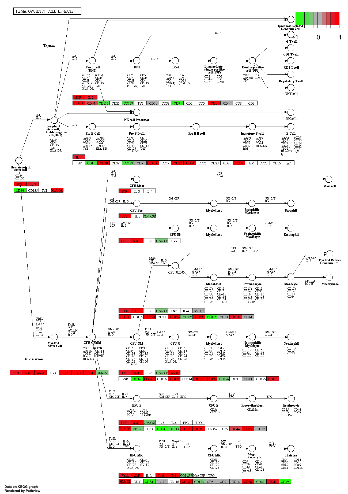
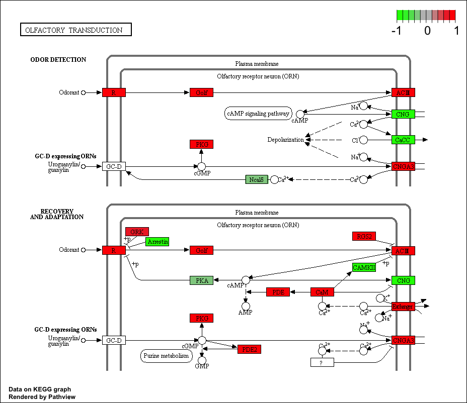

```{r setup, include=FALSE}
knitr::opts_chunk$set(echo = TRUE)
```


```{r}
library(DESeq2)
```


```{r}
metaFile <- "data/GSE37704_metadata.csv"
countFile <- "data/GSE37704_featurecounts.csv"

# Import metadata and take a peak
colData = read.csv(metaFile, row.names=1)
head(colData)
```


```{r}
# Import countdata
countData = read.csv(countFile, row.names=1)
head(countData)
```

```{r}
# Note we need to remove the odd first $length col
countData <- as.matrix(countData[,-1])
head(countData)
```

```{r}
# Filter count data where you have 0 read count across all samples.
countData = countData[rowSums(countData)>1, ]
head(countData)
```

```{r}
dds = DESeqDataSetFromMatrix(countData=countData,
                             colData=colData,
                             design=~condition)
dds = DESeq(dds)
```


```{r}
res <- results(dds)
res
```

```{r}
mcols(res, use.names = TRUE)

```


```{r}
summary(res)
```

Too many genes here so lets increase our thresholds of log2 fold change and decrease our FDR value 
```{r}
resSig <- results(dds,lfcThreshold=2, alpha=0.05)
summary(resSig)
```


```{r}
table(res$padj < 0.05)
table(res$log2FoldChange > 2)
table( res$padj < 0.05, res$log2FoldChange > 2)


```


```{r}
table(res$pvalue < 0.05)

```


```{r}
# Make a new results object 'resSig' with only significant genes
resSig <- subset(res, padj < 0.05)

# Print the first 10 strongest DOWN genes
ord.down <- order(resSig$log2FoldChange)
head(resSig[ ord.down, ], 10) 

```


Annotating our genes and mapping to Entrez IDs
```{r}
library("AnnotationDbi")
library("org.Hs.eg.db")

columns(org.Hs.eg.db)
```


```{r}
res$symbol = mapIds(org.Hs.eg.db,
                    keys=row.names(res), 
                    column="SYMBOL",
                    keytype="ENSEMBL",
                    multiVals="first")

res$entrez = mapIds(org.Hs.eg.db,
                    keys=row.names(res), 
                    column="ENTREZID",
                    keytype="ENSEMBL",
                    multiVals="first")

res$name =   mapIds(org.Hs.eg.db,
                    keys=row.names(res), 
                    column="GENENAME",
                    keytype="ENSEMBL",
                    multiVals="first")

head(res, 10)
```

KEGG Pathway 
```{r}
#source("http://bioconductor.org/biocLite.R")
#biocLite( c("pathview", "gage", "gageData") )
```

```{r}
library(pathview)
library(gage)
library(gageData)
```

```{r}
library(gage)
library(gageData)

data(kegg.sets.hs)
data(sigmet.idx.hs)

kegg.sets.hs = kegg.sets.hs[sigmet.idx.hs]
head(kegg.sets.hs, 3)
```

```{r}
foldchanges = res$log2FoldChange
names(foldchanges) = res$entrez
head(foldchanges)
```

```{r}
# Get the results
keggres = gage(foldchanges, gsets=kegg.sets.hs, same.dir=TRUE)

```

Look at results
```{r}
attributes(keggres)
```

```{r}
head(keggres$greater)

```


```{r}
head(keggres$less)

```


```{r}
lapply(keggres, head)

```


```{r}
## Sanity check displaying all pathways data
pathways = data.frame(id=rownames(keggres$greater), keggres$greater)
head(pathways)
```

```{r}
#pathview(gene.data=foldchanges, pathway.id="hsa04110")

```


```{r}
# A different PDF based output of the same data
pathview(gene.data=foldchanges, pathway.id="hsa04110", kegg.native=FALSE)
```


```{r}
## Focus on top 5 upregulated pathways here for demo purposes only
keggrespathways <- rownames(keggres$greater)[1:5]

# Extract the IDs part of each string
keggresids = substr(keggrespathways, start=1, stop=8)
keggresids
```


```{r}
#pathview(gene.data=foldchanges, pathway.id=keggresids, species="hsa")

```






Section 3. Gene Ontology (GO)

```{r}
data(go.sets.hs)
data(go.subs.hs)
gobpsets = go.sets.hs[go.subs.hs$BP]

gobpres = gage(foldchanges, gsets=gobpsets, same.dir=TRUE)

lapply(gobpres, head)
```

Section 4. Reactome Pathway Analysis
```{r}
sig_genes <- res[res$padj <= 0.05 & !is.na(res$padj), "symbol"]
print(paste("Total number of significant genes:", length(sig_genes)))
```

```{r}
write.table(sig_genes, file="significant_genes.txt", row.names=FALSE, col.names=FALSE, quote=FALSE)

```


Section 5. GO Analysis
```{r}
sessionInfo()

```


