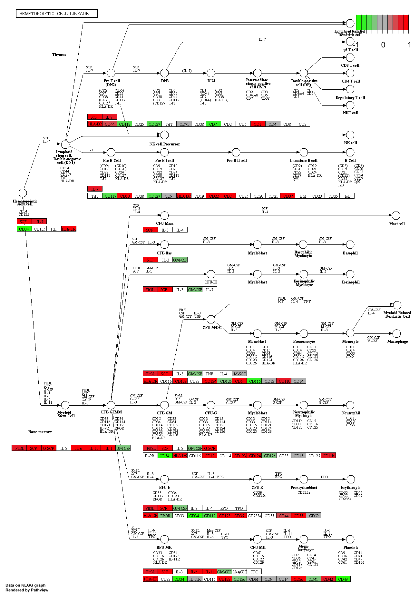
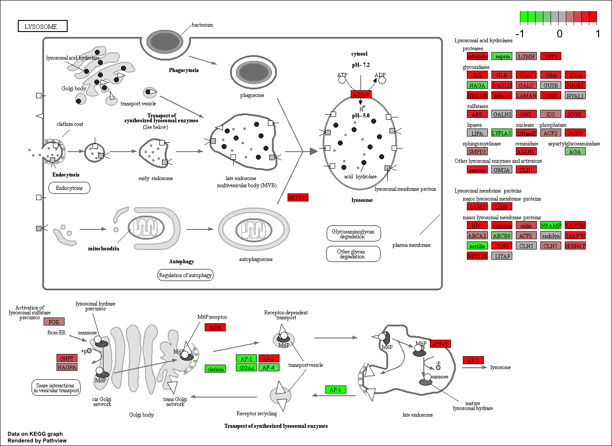

```r
library(DESeq2)
```

```
## Loading required package: S4Vectors
```

```
## Loading required package: stats4
```

```
## Loading required package: BiocGenerics
```

```
## Loading required package: parallel
```

```
## 
## Attaching package: 'BiocGenerics'
```

```
## The following objects are masked from 'package:parallel':
## 
##     clusterApply, clusterApplyLB, clusterCall, clusterEvalQ,
##     clusterExport, clusterMap, parApply, parCapply, parLapply,
##     parLapplyLB, parRapply, parSapply, parSapplyLB
```

```
## The following objects are masked from 'package:stats':
## 
##     IQR, mad, sd, var, xtabs
```

```
## The following objects are masked from 'package:base':
## 
##     anyDuplicated, append, as.data.frame, cbind, colMeans,
##     colnames, colSums, do.call, duplicated, eval, evalq, Filter,
##     Find, get, grep, grepl, intersect, is.unsorted, lapply,
##     lengths, Map, mapply, match, mget, order, paste, pmax,
##     pmax.int, pmin, pmin.int, Position, rank, rbind, Reduce,
##     rowMeans, rownames, rowSums, sapply, setdiff, sort, table,
##     tapply, union, unique, unsplit, which, which.max, which.min
```

```
## 
## Attaching package: 'S4Vectors'
```

```
## The following object is masked from 'package:base':
## 
##     expand.grid
```

```
## Loading required package: IRanges
```

```
## Loading required package: GenomicRanges
```

```
## Loading required package: GenomeInfoDb
```

```
## Loading required package: SummarizedExperiment
```

```
## Loading required package: Biobase
```

```
## Welcome to Bioconductor
## 
##     Vignettes contain introductory material; view with
##     'browseVignettes()'. To cite Bioconductor, see
##     'citation("Biobase")', and for packages 'citation("pkgname")'.
```

```
## Loading required package: DelayedArray
```

```
## Loading required package: matrixStats
```

```
## 
## Attaching package: 'matrixStats'
```

```
## The following objects are masked from 'package:Biobase':
## 
##     anyMissing, rowMedians
```

```
## 
## Attaching package: 'DelayedArray'
```

```
## The following objects are masked from 'package:matrixStats':
## 
##     colMaxs, colMins, colRanges, rowMaxs, rowMins, rowRanges
```

```
## The following object is masked from 'package:base':
## 
##     apply
```


```r
metaFile <- "data/GSE37704_metadata.csv"
countFile <- "data/GSE37704_featurecounts.csv"

# Import metadata and take a peak
colData = read.csv(metaFile, row.names=1)
head(colData)
```

```
##               condition
## SRR493366 control_sirna
## SRR493367 control_sirna
## SRR493368 control_sirna
## SRR493369      hoxa1_kd
## SRR493370      hoxa1_kd
## SRR493371      hoxa1_kd
```


```r
# Import countdata
countData = read.csv(countFile, row.names=1)
head(countData)
```

```
##                 length SRR493366 SRR493367 SRR493368 SRR493369 SRR493370
## ENSG00000186092    918         0         0         0         0         0
## ENSG00000279928    718         0         0         0         0         0
## ENSG00000279457   1982        23        28        29        29        28
## ENSG00000278566    939         0         0         0         0         0
## ENSG00000273547    939         0         0         0         0         0
## ENSG00000187634   3214       124       123       205       207       212
##                 SRR493371
## ENSG00000186092         0
## ENSG00000279928         0
## ENSG00000279457        46
## ENSG00000278566         0
## ENSG00000273547         0
## ENSG00000187634       258
```


```r
# Note we need to remove the odd first $length col
countData <- as.matrix(countData[,-1])
head(countData)
```

```
##                 SRR493366 SRR493367 SRR493368 SRR493369 SRR493370
## ENSG00000186092         0         0         0         0         0
## ENSG00000279928         0         0         0         0         0
## ENSG00000279457        23        28        29        29        28
## ENSG00000278566         0         0         0         0         0
## ENSG00000273547         0         0         0         0         0
## ENSG00000187634       124       123       205       207       212
##                 SRR493371
## ENSG00000186092         0
## ENSG00000279928         0
## ENSG00000279457        46
## ENSG00000278566         0
## ENSG00000273547         0
## ENSG00000187634       258
```


```r
# Filter count data where you have 0 read count across all samples.
countData = countData[rowSums(countData)>1, ]
head(countData)
```

```
##                 SRR493366 SRR493367 SRR493368 SRR493369 SRR493370
## ENSG00000279457        23        28        29        29        28
## ENSG00000187634       124       123       205       207       212
## ENSG00000188976      1637      1831      2383      1226      1326
## ENSG00000187961       120       153       180       236       255
## ENSG00000187583        24        48        65        44        48
## ENSG00000187642         4         9        16        14        16
##                 SRR493371
## ENSG00000279457        46
## ENSG00000187634       258
## ENSG00000188976      1504
## ENSG00000187961       357
## ENSG00000187583        64
## ENSG00000187642        16
```


```r
dds = DESeqDataSetFromMatrix(countData=countData,
                             colData=colData,
                             design=~condition)
dds = DESeq(dds)
```

```
## estimating size factors
```

```
## estimating dispersions
```

```
## gene-wise dispersion estimates
```

```
## mean-dispersion relationship
```

```
## final dispersion estimates
```

```
## fitting model and testing
```


```r
res <- results(dds)
res
```

```
## log2 fold change (MLE): condition hoxa1 kd vs control sirna 
## Wald test p-value: condition hoxa1 kd vs control sirna 
## DataFrame with 15280 rows and 6 columns
##                   baseMean log2FoldChange      lfcSE        stat
##                  <numeric>      <numeric>  <numeric>   <numeric>
## ENSG00000279457   29.91358     0.17927483 0.32459294   0.5523066
## ENSG00000187634  183.22965     0.42644724 0.14017817   3.0421802
## ENSG00000188976 1651.18808    -0.69272061 0.05484412 -12.6307173
## ENSG00000187961  209.63794     0.72975918 0.13178350   5.5375609
## ENSG00000187583   47.25512     0.04055411 0.27169055   0.1492658
## ...                    ...            ...        ...         ...
## ENSG00000273748  35.302652      0.6743994  0.3034582   2.2223801
## ENSG00000278817   2.423024     -0.3889516  1.1295943  -0.3443286
## ENSG00000278384   1.101796      0.3328870  1.6590966   0.2006435
## ENSG00000276345  73.644956     -0.3561673  0.2075751  -1.7158482
## ENSG00000271254 181.595903     -0.6096640  0.1412340  -4.3166951
##                       pvalue         padj
##                    <numeric>    <numeric>
## ENSG00000279457 5.807383e-01 6.846746e-01
## ENSG00000187634 2.348712e-03 5.109223e-03
## ENSG00000188976 1.429690e-36 1.745815e-35
## ENSG00000187961 3.067131e-08 1.109758e-07
## ENSG00000187583 8.813439e-01 9.191354e-01
## ...                      ...          ...
## ENSG00000273748 2.625763e-02 4.756160e-02
## ENSG00000278817 7.305992e-01 8.086868e-01
## ENSG00000278384 8.409773e-01 8.927559e-01
## ENSG00000276345 8.618983e-02 1.389975e-01
## ENSG00000271254 1.583827e-05 4.470014e-05
```


```r
mcols(res, use.names = TRUE)
```

```
## DataFrame with 6 rows and 2 columns
##                        type
##                 <character>
## baseMean       intermediate
## log2FoldChange      results
## lfcSE               results
## stat                results
## pvalue              results
## padj                results
##                                                                description
##                                                                <character>
## baseMean                         mean of normalized counts for all samples
## log2FoldChange log2 fold change (MLE): condition hoxa1 kd vs control sirna
## lfcSE                  standard error: condition hoxa1 kd vs control sirna
## stat                   Wald statistic: condition hoxa1 kd vs control sirna
## pvalue              Wald test p-value: condition hoxa1 kd vs control sirna
## padj                                                  BH adjusted p-values
```


```r
summary(res)
```

```
## 
## out of 15280 with nonzero total read count
## adjusted p-value < 0.1
## LFC > 0 (up)     : 4352, 28% 
## LFC < 0 (down)   : 4400, 29% 
## outliers [1]     : 0, 0% 
## low counts [2]   : 590, 3.9% 
## (mean count < 1)
## [1] see 'cooksCutoff' argument of ?results
## [2] see 'independentFiltering' argument of ?results
```

Too many genes here so lets increase our thresholds of log2 fold change and decrease our FDR value 

```r
resSig <- results(dds,lfcThreshold=2, alpha=0.05)
summary(resSig)
```

```
## 
## out of 15280 with nonzero total read count
## adjusted p-value < 0.05
## LFC > 0 (up)     : 99, 0.65% 
## LFC < 0 (down)   : 134, 0.88% 
## outliers [1]     : 0, 0% 
## low counts [2]   : 1482, 9.7% 
## (mean count < 2)
## [1] see 'cooksCutoff' argument of ?results
## [2] see 'independentFiltering' argument of ?results
```


```r
table(res$padj < 0.05)
```

```
## 
## FALSE  TRUE 
##  6539  8151
```

```r
table(res$log2FoldChange > 2)
```

```
## 
## FALSE  TRUE 
## 14723   557
```

```r
table( res$padj < 0.05, res$log2FoldChange > 2)
```

```
##        
##         FALSE TRUE
##   FALSE  6333  206
##   TRUE   7837  314
```


```r
table(res$pvalue < 0.05)
```

```
## 
## FALSE  TRUE 
##  6686  8594
```


```r
# Make a new results object 'resSig' with only significant genes
resSig <- subset(res, padj < 0.05)

# Print the first 10 strongest DOWN genes
ord.down <- order(resSig$log2FoldChange)
head(resSig[ ord.down, ], 10) 
```

```
## log2 fold change (MLE): condition hoxa1 kd vs control sirna 
## Wald test p-value: condition hoxa1 kd vs control sirna 
## DataFrame with 10 rows and 6 columns
##                  baseMean log2FoldChange     lfcSE      stat       pvalue
##                 <numeric>      <numeric> <numeric> <numeric>    <numeric>
## ENSG00000171587  2.561658      -4.902903  1.514295 -3.237746 1.204782e-03
## ENSG00000155011  7.971242      -4.601385  1.147782 -4.008936 6.099288e-05
## ENSG00000101306  1.888372      -4.425978  1.644059 -2.692105 7.100260e-03
## ENSG00000179855  3.760403      -4.424858  1.400644 -3.159161 1.582241e-03
## ENSG00000188581  1.795033      -4.405196  1.637739 -2.689804 7.149406e-03
## ENSG00000164342  3.517655      -4.323085  1.415825 -3.053403 2.262620e-03
## ENSG00000117598  1.680397      -4.261884  1.686659 -2.526821 1.151003e-02
## ENSG00000180332  9.377022      -4.258232  0.966178 -4.407296 1.046691e-05
## ENSG00000136943  3.367218      -4.250652  1.454036 -2.923347 3.462904e-03
## ENSG00000204183  1.542573      -4.168844  1.679468 -2.482241 1.305591e-02
##                         padj
##                    <numeric>
## ENSG00000171587 0.0027291049
## ENSG00000155011 0.0001615844
## ENSG00000101306 0.0142919728
## ENSG00000179855 0.0035179536
## ENSG00000188581 0.0143825518
## ENSG00000164342 0.0049307055
## ENSG00000117598 0.0224039090
## ENSG00000180332 0.0000301340
## ENSG00000136943 0.0073542374
## ENSG00000204183 0.0251331758
```


Annotating our genes and mapping to Entrez IDs

```r
library("AnnotationDbi")
library("org.Hs.eg.db")
```

```
## 
```

```r
columns(org.Hs.eg.db)
```

```
##  [1] "ACCNUM"       "ALIAS"        "ENSEMBL"      "ENSEMBLPROT" 
##  [5] "ENSEMBLTRANS" "ENTREZID"     "ENZYME"       "EVIDENCE"    
##  [9] "EVIDENCEALL"  "GENENAME"     "GO"           "GOALL"       
## [13] "IPI"          "MAP"          "OMIM"         "ONTOLOGY"    
## [17] "ONTOLOGYALL"  "PATH"         "PFAM"         "PMID"        
## [21] "PROSITE"      "REFSEQ"       "SYMBOL"       "UCSCKG"      
## [25] "UNIGENE"      "UNIPROT"
```


```r
res$symbol = mapIds(org.Hs.eg.db,
                    keys=row.names(res), 
                    column="SYMBOL",
                    keytype="ENSEMBL",
                    multiVals="first")
```

```
## 'select()' returned 1:many mapping between keys and columns
```

```r
res$entrez = mapIds(org.Hs.eg.db,
                    keys=row.names(res), 
                    column="ENTREZID",
                    keytype="ENSEMBL",
                    multiVals="first")
```

```
## 'select()' returned 1:many mapping between keys and columns
```

```r
res$name =   mapIds(org.Hs.eg.db,
                    keys=row.names(res), 
                    column="GENENAME",
                    keytype="ENSEMBL",
                    multiVals="first")
```

```
## 'select()' returned 1:many mapping between keys and columns
```

```r
head(res, 10)
```

```
## log2 fold change (MLE): condition hoxa1 kd vs control sirna 
## Wald test p-value: condition hoxa1 kd vs control sirna 
## DataFrame with 10 rows and 9 columns
##                   baseMean log2FoldChange      lfcSE        stat
##                  <numeric>      <numeric>  <numeric>   <numeric>
## ENSG00000279457   29.91358     0.17927483 0.32459294   0.5523066
## ENSG00000187634  183.22965     0.42644724 0.14017817   3.0421802
## ENSG00000188976 1651.18808    -0.69272061 0.05484412 -12.6307173
## ENSG00000187961  209.63794     0.72975918 0.13178350   5.5375609
## ENSG00000187583   47.25512     0.04055411 0.27169055   0.1492658
## ENSG00000187642   11.97975     0.54275443 0.52117592   1.0414035
## ENSG00000188290  108.92213     2.05704993 0.19679801  10.4525953
## ENSG00000187608  350.71687     0.25737707 0.10267368   2.5067482
## ENSG00000188157 9128.43942     0.38990881 0.04673847   8.3423531
## ENSG00000131591  156.47908     0.19659758 0.14551980   1.3510022
##                       pvalue         padj       symbol      entrez
##                    <numeric>    <numeric>  <character> <character>
## ENSG00000279457 5.807383e-01 6.846746e-01 LOC102723897   102723897
## ENSG00000187634 2.348712e-03 5.109223e-03       SAMD11      148398
## ENSG00000188976 1.429690e-36 1.745815e-35        NOC2L       26155
## ENSG00000187961 3.067131e-08 1.109758e-07       KLHL17      339451
## ENSG00000187583 8.813439e-01 9.191354e-01      PLEKHN1       84069
## ENSG00000187642 2.976883e-01 4.016657e-01        PERM1       84808
## ENSG00000188290 1.425695e-25 1.226198e-24         HES4       57801
## ENSG00000187608 1.218475e-02 2.358287e-02        ISG15        9636
## ENSG00000188157 7.282663e-17 4.347108e-16         AGRN      375790
## ENSG00000131591 1.766947e-01 2.604501e-01     C1orf159       54991
##                                                                     name
##                                                              <character>
## ENSG00000279457                        WAS protein family homolog 2-like
## ENSG00000187634                 sterile alpha motif domain containing 11
## ENSG00000188976 NOC2 like nucleolar associated transcriptional repressor
## ENSG00000187961                              kelch like family member 17
## ENSG00000187583                 pleckstrin homology domain containing N1
## ENSG00000187642             PPARGC1 and ESRR induced regulator, muscle 1
## ENSG00000188290                   hes family bHLH transcription factor 4
## ENSG00000187608                            ISG15 ubiquitin-like modifier
## ENSG00000188157                                                    agrin
## ENSG00000131591                      chromosome 1 open reading frame 159
```

KEGG Pathway 

```r
#source("http://bioconductor.org/biocLite.R")
#biocLite( c("pathview", "gage", "gageData") )
```


```r
library(pathview)
```

```
## ##############################################################################
## Pathview is an open source software package distributed under GNU General
## Public License version 3 (GPLv3). Details of GPLv3 is available at
## http://www.gnu.org/licenses/gpl-3.0.html. Particullary, users are required to
## formally cite the original Pathview paper (not just mention it) in publications
## or products. For details, do citation("pathview") within R.
## 
## The pathview downloads and uses KEGG data. Non-academic uses may require a KEGG
## license agreement (details at http://www.kegg.jp/kegg/legal.html).
## ##############################################################################
```

```r
library(gage)
library(gageData)
```


```r
library(gage)
library(gageData)

data(kegg.sets.hs)
data(sigmet.idx.hs)

kegg.sets.hs = kegg.sets.hs[sigmet.idx.hs]
head(kegg.sets.hs, 3)
```

```
## $`hsa00232 Caffeine metabolism`
## [1] "10"   "1544" "1548" "1549" "1553" "7498" "9"   
## 
## $`hsa00983 Drug metabolism - other enzymes`
##  [1] "10"     "1066"   "10720"  "10941"  "151531" "1548"   "1549"  
##  [8] "1551"   "1553"   "1576"   "1577"   "1806"   "1807"   "1890"  
## [15] "221223" "2990"   "3251"   "3614"   "3615"   "3704"   "51733" 
## [22] "54490"  "54575"  "54576"  "54577"  "54578"  "54579"  "54600" 
## [29] "54657"  "54658"  "54659"  "54963"  "574537" "64816"  "7083"  
## [36] "7084"   "7172"   "7363"   "7364"   "7365"   "7366"   "7367"  
## [43] "7371"   "7372"   "7378"   "7498"   "79799"  "83549"  "8824"  
## [50] "8833"   "9"      "978"   
## 
## $`hsa00230 Purine metabolism`
##   [1] "100"    "10201"  "10606"  "10621"  "10622"  "10623"  "107"   
##   [8] "10714"  "108"    "10846"  "109"    "111"    "11128"  "11164" 
##  [15] "112"    "113"    "114"    "115"    "122481" "122622" "124583"
##  [22] "132"    "158"    "159"    "1633"   "171568" "1716"   "196883"
##  [29] "203"    "204"    "205"    "221823" "2272"   "22978"  "23649" 
##  [36] "246721" "25885"  "2618"   "26289"  "270"    "271"    "27115" 
##  [43] "272"    "2766"   "2977"   "2982"   "2983"   "2984"   "2986"  
##  [50] "2987"   "29922"  "3000"   "30833"  "30834"  "318"    "3251"  
##  [57] "353"    "3614"   "3615"   "3704"   "377841" "471"    "4830"  
##  [64] "4831"   "4832"   "4833"   "4860"   "4881"   "4882"   "4907"  
##  [71] "50484"  "50940"  "51082"  "51251"  "51292"  "5136"   "5137"  
##  [78] "5138"   "5139"   "5140"   "5141"   "5142"   "5143"   "5144"  
##  [85] "5145"   "5146"   "5147"   "5148"   "5149"   "5150"   "5151"  
##  [92] "5152"   "5153"   "5158"   "5167"   "5169"   "51728"  "5198"  
##  [99] "5236"   "5313"   "5315"   "53343"  "54107"  "5422"   "5424"  
## [106] "5425"   "5426"   "5427"   "5430"   "5431"   "5432"   "5433"  
## [113] "5434"   "5435"   "5436"   "5437"   "5438"   "5439"   "5440"  
## [120] "5441"   "5471"   "548644" "55276"  "5557"   "5558"   "55703" 
## [127] "55811"  "55821"  "5631"   "5634"   "56655"  "56953"  "56985" 
## [134] "57804"  "58497"  "6240"   "6241"   "64425"  "646625" "654364"
## [141] "661"    "7498"   "8382"   "84172"  "84265"  "84284"  "84618" 
## [148] "8622"   "8654"   "87178"  "8833"   "9060"   "9061"   "93034" 
## [155] "953"    "9533"   "954"    "955"    "956"    "957"    "9583"  
## [162] "9615"
```


```r
foldchanges = res$log2FoldChange
names(foldchanges) = res$entrez
head(foldchanges)
```

```
##   102723897      148398       26155      339451       84069       84808 
##  0.17927483  0.42644724 -0.69272061  0.72975918  0.04055411  0.54275443
```


```r
# Get the results
keggres = gage(foldchanges, gsets=kegg.sets.hs, same.dir=TRUE)
```

Look at results

```r
attributes(keggres)
```

```
## $names
## [1] "greater" "less"    "stats"
```


```r
head(keggres$greater)
```

```
##                                         p.geomean stat.mean       p.val
## hsa04640 Hematopoietic cell lineage   0.002709366  2.857393 0.002709366
## hsa04630 Jak-STAT signaling pathway   0.005655916  2.557207 0.005655916
## hsa04142 Lysosome                     0.008948808  2.384783 0.008948808
## hsa00140 Steroid hormone biosynthesis 0.009619717  2.432105 0.009619717
## hsa04740 Olfactory transduction       0.010846448  2.357877 0.010846448
## hsa04916 Melanogenesis                0.017613266  2.123151 0.017613266
##                                           q.val set.size        exp1
## hsa04640 Hematopoietic cell lineage   0.3470863       49 0.002709366
## hsa04630 Jak-STAT signaling pathway   0.3470863      103 0.005655916
## hsa04142 Lysosome                     0.3470863      117 0.008948808
## hsa00140 Steroid hormone biosynthesis 0.3470863       26 0.009619717
## hsa04740 Olfactory transduction       0.3470863       39 0.010846448
## hsa04916 Melanogenesis                0.4696871       85 0.017613266
```


```r
head(keggres$less)
```

```
##                                      p.geomean stat.mean        p.val
## hsa04110 Cell cycle               1.004024e-05 -4.353447 1.004024e-05
## hsa03030 DNA replication          8.909718e-05 -3.968605 8.909718e-05
## hsa03013 RNA transport            1.333746e-03 -3.038773 1.333746e-03
## hsa04114 Oocyte meiosis           2.496109e-03 -2.840329 2.496109e-03
## hsa03440 Homologous recombination 2.942017e-03 -2.868137 2.942017e-03
## hsa00240 Pyrimidine metabolism    5.800212e-03 -2.549616 5.800212e-03
##                                         q.val set.size         exp1
## hsa04110 Cell cycle               0.001606438      120 1.004024e-05
## hsa03030 DNA replication          0.007127774       36 8.909718e-05
## hsa03013 RNA transport            0.071133118      143 1.333746e-03
## hsa04114 Oocyte meiosis           0.094144560       98 2.496109e-03
## hsa03440 Homologous recombination 0.094144560       28 2.942017e-03
## hsa00240 Pyrimidine metabolism    0.138500584       95 5.800212e-03
```


```r
lapply(keggres, head)
```

```
## $greater
##                                         p.geomean stat.mean       p.val
## hsa04640 Hematopoietic cell lineage   0.002709366  2.857393 0.002709366
## hsa04630 Jak-STAT signaling pathway   0.005655916  2.557207 0.005655916
## hsa04142 Lysosome                     0.008948808  2.384783 0.008948808
## hsa00140 Steroid hormone biosynthesis 0.009619717  2.432105 0.009619717
## hsa04740 Olfactory transduction       0.010846448  2.357877 0.010846448
## hsa04916 Melanogenesis                0.017613266  2.123151 0.017613266
##                                           q.val set.size        exp1
## hsa04640 Hematopoietic cell lineage   0.3470863       49 0.002709366
## hsa04630 Jak-STAT signaling pathway   0.3470863      103 0.005655916
## hsa04142 Lysosome                     0.3470863      117 0.008948808
## hsa00140 Steroid hormone biosynthesis 0.3470863       26 0.009619717
## hsa04740 Olfactory transduction       0.3470863       39 0.010846448
## hsa04916 Melanogenesis                0.4696871       85 0.017613266
## 
## $less
##                                      p.geomean stat.mean        p.val
## hsa04110 Cell cycle               1.004024e-05 -4.353447 1.004024e-05
## hsa03030 DNA replication          8.909718e-05 -3.968605 8.909718e-05
## hsa03013 RNA transport            1.333746e-03 -3.038773 1.333746e-03
## hsa04114 Oocyte meiosis           2.496109e-03 -2.840329 2.496109e-03
## hsa03440 Homologous recombination 2.942017e-03 -2.868137 2.942017e-03
## hsa00240 Pyrimidine metabolism    5.800212e-03 -2.549616 5.800212e-03
##                                         q.val set.size         exp1
## hsa04110 Cell cycle               0.001606438      120 1.004024e-05
## hsa03030 DNA replication          0.007127774       36 8.909718e-05
## hsa03013 RNA transport            0.071133118      143 1.333746e-03
## hsa04114 Oocyte meiosis           0.094144560       98 2.496109e-03
## hsa03440 Homologous recombination 0.094144560       28 2.942017e-03
## hsa00240 Pyrimidine metabolism    0.138500584       95 5.800212e-03
## 
## $stats
##                                       stat.mean     exp1
## hsa04640 Hematopoietic cell lineage    2.857393 2.857393
## hsa04630 Jak-STAT signaling pathway    2.557207 2.557207
## hsa04142 Lysosome                      2.384783 2.384783
## hsa00140 Steroid hormone biosynthesis  2.432105 2.432105
## hsa04740 Olfactory transduction        2.357877 2.357877
## hsa04916 Melanogenesis                 2.123151 2.123151
```


```r
## Sanity check displaying all pathways data
pathways = data.frame(id=rownames(keggres$greater), keggres$greater)
head(pathways)
```

```
##                                                                          id
## hsa04640 Hematopoietic cell lineage     hsa04640 Hematopoietic cell lineage
## hsa04630 Jak-STAT signaling pathway     hsa04630 Jak-STAT signaling pathway
## hsa04142 Lysosome                                         hsa04142 Lysosome
## hsa00140 Steroid hormone biosynthesis hsa00140 Steroid hormone biosynthesis
## hsa04740 Olfactory transduction             hsa04740 Olfactory transduction
## hsa04916 Melanogenesis                               hsa04916 Melanogenesis
##                                         p.geomean stat.mean       p.val
## hsa04640 Hematopoietic cell lineage   0.002709366  2.857393 0.002709366
## hsa04630 Jak-STAT signaling pathway   0.005655916  2.557207 0.005655916
## hsa04142 Lysosome                     0.008948808  2.384783 0.008948808
## hsa00140 Steroid hormone biosynthesis 0.009619717  2.432105 0.009619717
## hsa04740 Olfactory transduction       0.010846448  2.357877 0.010846448
## hsa04916 Melanogenesis                0.017613266  2.123151 0.017613266
##                                           q.val set.size        exp1
## hsa04640 Hematopoietic cell lineage   0.3470863       49 0.002709366
## hsa04630 Jak-STAT signaling pathway   0.3470863      103 0.005655916
## hsa04142 Lysosome                     0.3470863      117 0.008948808
## hsa00140 Steroid hormone biosynthesis 0.3470863       26 0.009619717
## hsa04740 Olfactory transduction       0.3470863       39 0.010846448
## hsa04916 Melanogenesis                0.4696871       85 0.017613266
```


```r
#pathview(gene.data=foldchanges, pathway.id="hsa04110")
```


```r
# A different PDF based output of the same data
pathview(gene.data=foldchanges, pathway.id="hsa04110", kegg.native=FALSE)
```

```
## 'select()' returned 1:1 mapping between keys and columns
```

```
## Info: Working in directory /Users/PengHuang/Documents/BGGN 213/bggn213_github/Lecture 14 Lecture 14
```

```
## Info: Writing image file hsa04110.pathview.pdf
```


```r
## Focus on top 5 upregulated pathways here for demo purposes only
keggrespathways <- rownames(keggres$greater)[1:5]

# Extract the IDs part of each string
keggresids = substr(keggrespathways, start=1, stop=8)
keggresids
```

```
## [1] "hsa04640" "hsa04630" "hsa04142" "hsa00140" "hsa04740"
```


```r
#pathview(gene.data=foldchanges, pathway.id=keggresids, species="hsa")
```







Section 3. Gene Ontology (GO)


```r
data(go.sets.hs)
data(go.subs.hs)
gobpsets = go.sets.hs[go.subs.hs$BP]

gobpres = gage(foldchanges, gsets=gobpsets, same.dir=TRUE)

lapply(gobpres, head)
```

```
## $greater
##                                              p.geomean stat.mean
## GO:0007156 homophilic cell adhesion       4.893044e-05  3.971869
## GO:0060429 epithelium development         6.727999e-05  3.834578
## GO:0007610 behavior                       2.171759e-04  3.534089
## GO:0048729 tissue morphogenesis           2.471263e-04  3.498950
## GO:0002009 morphogenesis of an epithelium 3.227727e-04  3.429293
## GO:0016337 cell-cell adhesion             8.194676e-04  3.163087
##                                                  p.val     q.val set.size
## GO:0007156 homophilic cell adhesion       4.893044e-05 0.1337863      107
## GO:0060429 epithelium development         6.727999e-05 0.1337863      478
## GO:0007610 behavior                       2.171759e-04 0.2457053      404
## GO:0048729 tissue morphogenesis           2.471263e-04 0.2457053      403
## GO:0002009 morphogenesis of an epithelium 3.227727e-04 0.2567334      326
## GO:0016337 cell-cell adhesion             8.194676e-04 0.3753986      318
##                                                   exp1
## GO:0007156 homophilic cell adhesion       4.893044e-05
## GO:0060429 epithelium development         6.727999e-05
## GO:0007610 behavior                       2.171759e-04
## GO:0048729 tissue morphogenesis           2.471263e-04
## GO:0002009 morphogenesis of an epithelium 3.227727e-04
## GO:0016337 cell-cell adhesion             8.194676e-04
## 
## $less
##                                             p.geomean stat.mean
## GO:0000279 M phase                       1.475275e-16 -8.323757
## GO:0048285 organelle fission             7.498096e-16 -8.160310
## GO:0000280 nuclear division              2.135081e-15 -8.034815
## GO:0007067 mitosis                       2.135081e-15 -8.034815
## GO:0000087 M phase of mitotic cell cycle 5.927745e-15 -7.891754
## GO:0007059 chromosome segregation        1.055849e-11 -6.988384
##                                                 p.val        q.val
## GO:0000279 M phase                       1.475275e-16 5.867170e-13
## GO:0048285 organelle fission             7.498096e-16 1.490996e-12
## GO:0000280 nuclear division              2.135081e-15 2.122805e-12
## GO:0007067 mitosis                       2.135081e-15 2.122805e-12
## GO:0000087 M phase of mitotic cell cycle 5.927745e-15 4.714928e-12
## GO:0007059 chromosome segregation        1.055849e-11 6.998521e-09
##                                          set.size         exp1
## GO:0000279 M phase                            492 1.475275e-16
## GO:0048285 organelle fission                  373 7.498096e-16
## GO:0000280 nuclear division                   349 2.135081e-15
## GO:0007067 mitosis                            349 2.135081e-15
## GO:0000087 M phase of mitotic cell cycle      359 5.927745e-15
## GO:0007059 chromosome segregation             141 1.055849e-11
## 
## $stats
##                                           stat.mean     exp1
## GO:0007156 homophilic cell adhesion        3.971869 3.971869
## GO:0060429 epithelium development          3.834578 3.834578
## GO:0007610 behavior                        3.534089 3.534089
## GO:0048729 tissue morphogenesis            3.498950 3.498950
## GO:0002009 morphogenesis of an epithelium  3.429293 3.429293
## GO:0016337 cell-cell adhesion              3.163087 3.163087
```

Section 4. Reactome Pathway Analysis

```r
sig_genes <- res[res$padj <= 0.05 & !is.na(res$padj), "symbol"]
print(paste("Total number of significant genes:", length(sig_genes)))
```

```
## [1] "Total number of significant genes: 8151"
```


```r
write.table(sig_genes, file="significant_genes.txt", row.names=FALSE, col.names=FALSE, quote=FALSE)
```


Section 5. GO Analysis

```r
sessionInfo()
```

```
## R version 3.4.4 (2018-03-15)
## Platform: x86_64-apple-darwin15.6.0 (64-bit)
## Running under: macOS High Sierra 10.13.4
## 
## Matrix products: default
## BLAS: /Library/Frameworks/R.framework/Versions/3.4/Resources/lib/libRblas.0.dylib
## LAPACK: /Library/Frameworks/R.framework/Versions/3.4/Resources/lib/libRlapack.dylib
## 
## locale:
## [1] en_US.UTF-8/en_US.UTF-8/en_US.UTF-8/C/en_US.UTF-8/en_US.UTF-8
## 
## attached base packages:
## [1] parallel  stats4    stats     graphics  grDevices utils     datasets 
## [8] methods   base     
## 
## other attached packages:
##  [1] gageData_2.16.0            gage_2.28.2               
##  [3] pathview_1.18.2            org.Hs.eg.db_3.5.0        
##  [5] AnnotationDbi_1.40.0       DESeq2_1.18.1             
##  [7] SummarizedExperiment_1.8.1 DelayedArray_0.4.1        
##  [9] matrixStats_0.53.1         Biobase_2.38.0            
## [11] GenomicRanges_1.30.3       GenomeInfoDb_1.14.0       
## [13] IRanges_2.12.0             S4Vectors_0.16.0          
## [15] BiocGenerics_0.24.0       
## 
## loaded via a namespace (and not attached):
##  [1] httr_1.3.1             bit64_0.9-7            splines_3.4.4         
##  [4] Formula_1.2-3          latticeExtra_0.6-28    blob_1.1.1            
##  [7] GenomeInfoDbData_1.0.0 yaml_2.1.18            pillar_1.2.1          
## [10] RSQLite_2.1.0          backports_1.1.2        lattice_0.20-35       
## [13] digest_0.6.15          RColorBrewer_1.1-2     XVector_0.18.0        
## [16] checkmate_1.8.5        colorspace_1.3-2       htmltools_0.3.6       
## [19] Matrix_1.2-12          plyr_1.8.4             XML_3.98-1.11         
## [22] pkgconfig_2.0.1        genefilter_1.60.0      zlibbioc_1.24.0       
## [25] xtable_1.8-2           scales_0.5.0           BiocParallel_1.12.0   
## [28] htmlTable_1.11.2       tibble_1.4.2           annotate_1.56.2       
## [31] KEGGREST_1.18.1        ggplot2_2.2.1          nnet_7.3-12           
## [34] lazyeval_0.2.1         survival_2.41-3        magrittr_1.5          
## [37] memoise_1.1.0          evaluate_0.10.1        KEGGgraph_1.38.0      
## [40] foreign_0.8-69         graph_1.56.0           tools_3.4.4           
## [43] data.table_1.10.4-3    stringr_1.3.0          munsell_0.4.3         
## [46] locfit_1.5-9.1         cluster_2.0.6          Biostrings_2.46.0     
## [49] compiler_3.4.4         rlang_0.2.0            grid_3.4.4            
## [52] RCurl_1.95-4.10        rstudioapi_0.7         htmlwidgets_1.2       
## [55] bitops_1.0-6           base64enc_0.1-3        rmarkdown_1.9         
## [58] gtable_0.2.0           DBI_1.0.0              R6_2.2.2              
## [61] gridExtra_2.3          knitr_1.20             bit_1.1-12            
## [64] Hmisc_4.1-1            rprojroot_1.3-2        Rgraphviz_2.22.0      
## [67] stringi_1.1.7          Rcpp_0.12.16           png_0.1-7             
## [70] geneplotter_1.56.0     rpart_4.1-13           acepack_1.4.1
```


