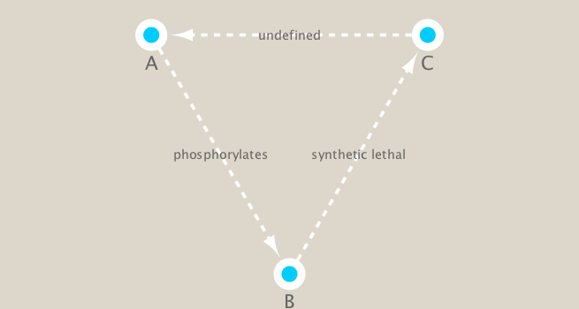
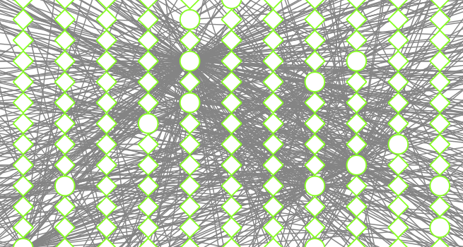
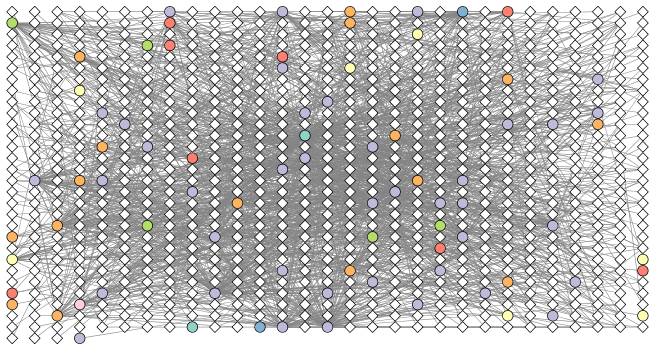

```{r setup, include=FALSE}
knitr::opts_chunk$set(echo = TRUE)
```

```{r}
#source("https://bioconductor.org/biocLite.R")
#biocLite("RCy3")
#biocLite("igraph")
#biocLite("RColorBrewer")
```


```{r}
library(RCy3)
library(igraph)
library(RColorBrewer)
```


```{r}
library(RCy3)
cwd <- demoSimpleGraph()
```


```{r}
layoutNetwork(cwd, 'force-directed')

# choose any of the other possible layouts e.g.:
possible.layout.names <- getLayoutNames(cwd)
layoutNetwork (cwd, possible.layout.names[1])

# Test the connection to Cytoscape.
ping(cwd)
```

```{r}
saveImage(cwd,
          file.name="demo",
          image.type="png",
          h=350)
```

```{r}
setVisualStyle(cwd, "Marquee")

```


```{r}
saveImage(cwd,
          file.name="demo_marquee",
          image.type="png",
          h=350)


```


```{r}
styles <- getVisualStyleNames(cwd)
styles
```


```{r}
#setVisualStyle(cwd, styles[13])
#setVisualStyle(cwd, styles[18])
```


```{r}
## scripts for processing located in "inst/data-raw/"
prok_vir_cor <- read.delim("./data/virus_prok_cor_abundant.tsv", stringsAsFactors = FALSE)

## Have a peak at the first 6 rows
head(prok_vir_cor)
```

```{r}
g <- graph.data.frame(prok_vir_cor, directed = FALSE)

```

```{r}
class(g)

```

```{r}
g
```

```{r}
plot(g)

```


```{r}
plot(g, vertex.label=NA)

```


```{r}
plot(g, vertex.size=3, vertex.label=NA)

```

Network querys

```{r}
V(g)
```

```{r}
E(g)
```

```{r}
cb <- cluster_edge_betweenness(g)
cb
```


```{r}
plot(cb, y=g, vertex.label=NA,  vertex.size=3)

```

```{r}
head( membership(cb) )

```


Node degree
```{r}
# Calculate and plot node degree of our network
d <- degree(g)
hist(d, breaks=30, col="lightblue", main ="Node Degree Distribution")

```

```{r}
plot( degree_distribution(g), type="h" )

```


Centrality analysis


```{r}
pr <- page_rank(g)
head(pr$vector)
```

```{r}
#biocLite("BBmisc")
```

```{r}
# Make a size vector btwn 2 and 20 for node plotting size
v.size <- BBmisc::normalize(pr$vector, range=c(2,20), method="range")
plot(g, vertex.size=v.size, vertex.label=NA)
```


```{r}
v.size <- BBmisc::normalize(d, range=c(2,20), method="range")
plot(g, vertex.size=v.size, vertex.label=NA)
```


```{r}
b <- betweenness(g)
v.size <- BBmisc::normalize(b, range=c(2,20), method="range")
plot(g, vertex.size=v.size, vertex.label=NA)
```

Read taxonomic classification for network annotation
```{r}
phage_id_affiliation <- read.delim("./data/phage_ids_with_affiliation.tsv")
head(phage_id_affiliation)
```


```{r}
bac_id_affi <- read.delim("./data/prok_tax_from_silva.tsv", stringsAsFactors = FALSE)
head(bac_id_affi)
```


Add taxonomic annotation data to network

```{r}
## Extract out our vertex names
genenet.nodes <- as.data.frame(vertex.attributes(g), stringsAsFactors=FALSE)
head(genenet.nodes)
```

```{r}
length( grep("^ph_",genenet.nodes[,1]) )

```


```{r}
# We dont need all annotation data so lets make a reduced table 'z' for merging
z <- bac_id_affi[,c("Accession_ID", "Kingdom", "Phylum", "Class")]
n <- merge(genenet.nodes, z, by.x="name", by.y="Accession_ID", all.x=TRUE)
head(n) 
```


```{r}
# Check on the column names before deciding what to merge
colnames(n)
```

```{r}
colnames(phage_id_affiliation)

```


```{r}
# Again we only need a subset of `phage_id_affiliation` for our purposes
y <- phage_id_affiliation[, c("first_sheet.Phage_id_network", "phage_affiliation","Tax_order", "Tax_subfamily")]

# Add the little phage annotation that we have
x <- merge(x=n, y=y, by.x="name", by.y="first_sheet.Phage_id_network", all.x=TRUE)

## Remove duplicates from multiple matches
x <- x[!duplicated( (x$name) ),]
head(x)
```

```{r}
genenet.nodes <- x

```


```{r}
genenet.edges <- data.frame(igraph::as_edgelist(g))
names(genenet.edges) <- c("name.1",
                          "name.2")
genenet.edges$Weight <- igraph::edge_attr(g)[[1]]

genenet.edges$name.1 <- as.character(genenet.edges$name.1)
genenet.edges$name.2 <- as.character(genenet.edges$name.2)
genenet.nodes$name <- as.character(genenet.nodes$name)

ug <- cyPlot(genenet.nodes,genenet.edges)
```

```{r}
# Open a new connection and delete any existing windows/networks in Cy
cy <- CytoscapeConnection()
deleteAllWindows(cy)
```


```{r}
cw <- CytoscapeWindow("Tara oceans",
                      graph = ug,
                      overwriteWindow = TRUE)
```

```{r}
displayGraph(cw)
layoutNetwork(cw)
fitContent(cw)
```


```{r}
families_to_colour <- unique(genenet.nodes$Phylum)
families_to_colour <- families_to_colour[!is.na(families_to_colour)]

node.colour <- RColorBrewer::brewer.pal(length(families_to_colour), "Set3")
```


```{r}
setNodeColorRule(cw,
                 "Phylum",
                 families_to_colour,
                 node.colour,
                 "lookup",
                 default.color = "#ffffff")
```


```{r}
saveImage(cw,
          file.name="net2",
          image.type="png",
          h=350)
```


```{r}
library(knitr)

```

```{r}


```

Set node shape to reflect virus or prokaryote
```{r}
shapes_for_nodes <- c("DIAMOND")

phage_names <- grep("ph_",
                    genenet.nodes$name,
                    value = TRUE)
setNodeShapeRule(cw,
                 "label",
                 phage_names,
                 shapes_for_nodes)
```

```{r}
displayGraph(cw)
fitContent(cw)
```

Colour edges of phage nodes
```{r}
setDefaultNodeBorderWidth(cw, 5)
families_to_colour <- c("Podoviridae",
                        "Siphoviridae",
                        "Myoviridae")

node.colour <- RColorBrewer::brewer.pal(length(families_to_colour),
                          "Dark2")
setNodeBorderColorRule(cw,
                       "Tax_subfamily",
                       families_to_colour,
                       node.colour,
                       "lookup", 
                       default.color = "#000000")
```

```{r}
displayGraph(cw)
fitContent(cw)
```

```{r}
saveImage(cw,
          "co-occur2",
          "png",
          h=350)

```

Use a network layout to minimize the overlap of nodes.
```{r}
getLayoutNames(cw)

```


```{r}
getLayoutPropertyNames(cw, layout.name="force-directed")

```


```{r}
getLayoutPropertyValue(cw, "force-directed", "defaultSpringLength") 

```


```{r}
getLayoutPropertyValue(cw, "force-directed", "numIterations")  

```


```{r}
layoutNetwork(cw, layout.name = "force-directed")
fitContent(cw)
```


Look at network properties

```{r}
## initiate a new node attribute
ug2 <- initNodeAttribute(graph = ug,
                          "degree",
                          "numeric",
                          0.0) 

## Use the igraph to calculate degree from the original graph
nodeData(ug2, nodes(ug2), "degree") <- igraph::degree(g)

cw2 <- CytoscapeWindow("Tara oceans with degree",
                      graph = ug2,
                      overwriteWindow = TRUE)
```

```{r}
displayGraph(cw2)
layoutNetwork(cw2)
```


Size by degree
```{r}
degree_control_points <- c(min(igraph::degree(g)),
                           mean(igraph::degree(g)),
                           max(igraph::degree(g)))
node_sizes <- c(20,
                20,
                80,
                100,
                110) # number of control points in interpolation mode,
                     # the first and the last are for sizes "below" and "above" the attribute seen.

setNodeSizeRule(cw2,
                "degree",
                degree_control_points,
                node_sizes,
                mode = "interpolate")
```

```{r}
layoutNetwork(cw2,
              "force-directed")
```


