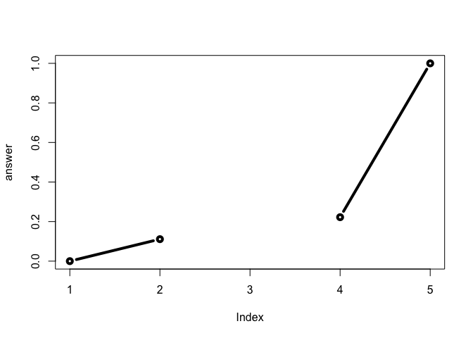
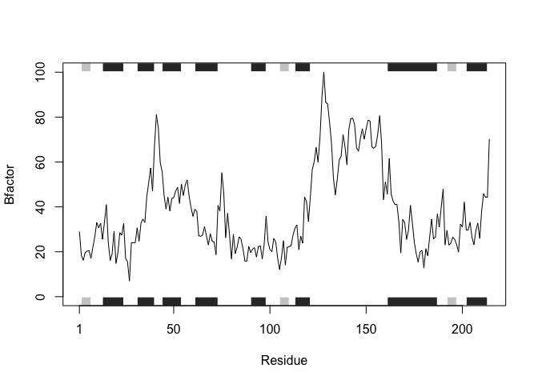
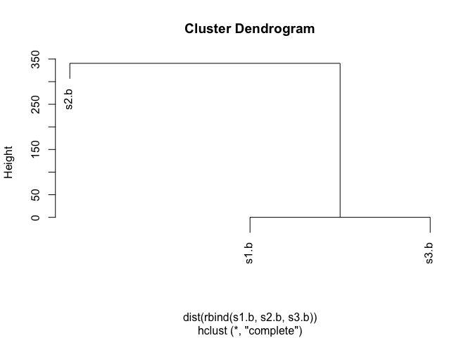

### Let look at the poor old function 

This is the function code from Barry's student. 


```r
# Old function 
map.colors <- function (value,high.low,palette) {
  proportion <- ((value-high.low[1])/(high.low[2]-high.low[1]))
  index <- round ((length(palette)-1)*proportion)+1
  return (palette[index])
}
```

Now lets try to understand this function

```r
map.colors2 <- function (x, high.low = range(x), palette = cm.colors(100)) {

  # Determine where in the 'high.low' range or our values of 'x' lie.  
  percent <- ((x - high.low[1]) / (high.low[2] - high.low[1]))
  
  # Where in the 'palette' vector of colors is this 'percent'
  # note catch for 0 percent values to 1
  index <- round ( (length(palette)-1) * percent)+1
  
  return (palette[index])
}
```

# Every function has three things 1. Name 2. Inputs. 3. Body 
# Name <- function(input) {
# Body 
# }

## Working with our own functions 
My first function 


```r
add <- function(x, y=1) {
 # Sum the input x and y
 x + y
}
```
Lets test our first function 


```r
add(6, 4)
```

```
## [1] 10
```

```r
add( c(1:5), 20)
```

```
## [1] 21 22 23 24 25
```
Does this work 

```r
#add(1,2,2)
```

Write my second function

```r
rescale <- function(x) {
 rng <-range(x)
 (x - rng[1]) / (rng[2] - rng[1])
}
```

Test my second function 

```r
rescale( 1:10 )
```

```
##  [1] 0.0000000 0.1111111 0.2222222 0.3333333 0.4444444 0.5555556 0.6666667
##  [8] 0.7777778 0.8888889 1.0000000
```

```r
rescale( c(1,2,NA,3,10))
```

```
## [1] NA NA NA NA NA
```


```r
rescale2 <- function(x) {
 rng <-range(x, na.rm = TRUE)
 (x - rng[1]) / (rng[2] - rng[1])
}
```


```r
rescale2( c(1,2,NA,3,10))
```

```
## [1] 0.0000000 0.1111111        NA 0.2222222 1.0000000
```


```r
rescale3 <- function(x, na.rm=TRUE, plot=FALSE) {
 if(na.rm) {
 rng <-range(x, na.rm=na.rm)
 } else {
 rng <-range(x)
 }
 print("Hello")
 answer <- (x - rng[1]) / (rng[2] - rng[1])
 print("is it me you are looking for?")
 if(plot) {
 plot(answer, typ="b", lwd=4)
 }
 print("I can see it in ...")
 return(answer)
}
```


```r
rescale3( c(1,2,NA,3,10), plot = TRUE)
```

```
## [1] "Hello"
## [1] "is it me you are looking for?"
```

<!-- -->

```
## [1] "I can see it in ..."
```

```
## [1] 0.0000000 0.1111111        NA 0.2222222 1.0000000
```


## Section 3B from Class 6

```r
library(bio3d)
```

```r
library(bio3d)
s1 <- read.pdb("4AKE") # kinase with drug
```

```
##   Note: Accessing on-line PDB file
```

```r
s2 <- read.pdb("1AKE") # kinase no drug
```

```
##   Note: Accessing on-line PDB file
##    PDB has ALT records, taking A only, rm.alt=TRUE
```

```r
s3 <- read.pdb("1E4Y") # kinase with drug
```

```
##   Note: Accessing on-line PDB file
```

```r
s1.chainA <- trim.pdb(s1, chain="A", elety="CA")
s2.chainA <- trim.pdb(s2, chain="A", elety="CA")
s3.chainA <- trim.pdb(s1, chain="A", elety="CA")
s1.b <- s1.chainA$atom$b
s2.b <- s2.chainA$atom$b
s3.b <- s3.chainA$atom$b
plotb3(s1.b, sse=s1.chainA, typ="l", ylab="Bfactor")
```

<!-- -->

```r
plotb3(s2.b, sse=s2.chainA, typ="l", ylab="Bfactor")
```

<!-- -->

```r
plotb3(s3.b, sse=s3.chainA, typ="l", ylab="Bfactor")
```

<!-- -->


```r
hc <- hclust( dist( rbind(s1.b, s2.b, s3.b) ) )
plot(hc)
```

<!-- -->


```r
library(bio3d)
s1 <- read.pdb("4AKE")
```

```
##   Note: Accessing on-line PDB file
```

```
## Warning in get.pdb(file, path = tempdir(), verbose = FALSE): /var/folders/
## _k/hrlc3gnd13b7tf6swprw3psr0000gn/T//Rtmpd1GS7C/4AKE.pdb exists. Skipping
## download
```

```r
s1.chainA <- trim.pdb(s1, chain="A", elety="CA")
s1.b <- s1.chainA$atom$b
plotb3(s1.b, sse=s1.chainA, typ="l", ylab="Bfactor") 
```

<!-- -->

```r
hc <- hclust( dist( rbind(s1.b, s2.b, s3.b) ) )
plot(hc)
```

<!-- -->


```r
x <- read.pdb("4AKE")
```

```
##   Note: Accessing on-line PDB file
```

```
## Warning in get.pdb(file, path = tempdir(), verbose = FALSE): /var/folders/
## _k/hrlc3gnd13b7tf6swprw3psr0000gn/T//Rtmpd1GS7C/4AKE.pdb exists. Skipping
## download
```


